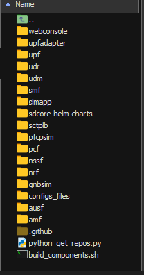
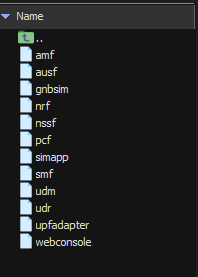

### Índice

- [Pasos iniciales](#pasos-iniciales)
  - [Instalaciones necesarias](#instalaciones-necesarias)
  - [Clonar repositorios](#clonar-repositorios)
  - [Construir componentes](#construir-componentes)
  - [Obtener builds](#obtener-builds)

- [Ejecutar componentes individualmente](#ejecutar-componentes-individualmente)
- [Entorno de docker](#entorno-de-docker)
---

### Pasos iniciales
Objetivo: construir las imagenes de cada uno de los componentes de Aether, utilizando nuestra configuracion hacer un entorno valido para el desarrollo. Hacer ese entorno utilizando solo docker. Luego hacerlo utilizando kubernetes y los helm charts ya creados por la comunidad de aether.

### Instalaciones necesarias
Las instalaciones necesarias son las siguientes:
- [Go](https://go.dev/doc/install)
- [Docker](https://docs.docker.com/engine/install/ubuntu/)
- [Kubectl](https://kubernetes.io/docs/tasks/tools/install-kubectl-linux/)
- [Minikube](https://minikube.sigs.k8s.io/docs/start/?arch=%2Fwindows%2Fx86-64%2Fstable%2F.exe+download)
- Python version >= 3.8

### Clonar repositorios
En nuestro entorno ejecutar los siguientes comandos:
```bash
cd ~
mkdir aether-forks
cd aether-forks
```

Crear aqui el archivo `python_get_repos.py`:
```bash
touch python_get_repos.py
```

Copiar el siguiente código (Para clonar todos los repo rapidamente):
```python
import requests
import os

user = "networkgcorefullcode"  # Reemplaza con el nombre de usuario
url = f"https://api.github.com/users/{user}/repos?per_page=100"
repos = requests.get(url).json()

for repo in repos:
    os.system(f"git clone {repo['clone_url']}")
```

```bash
python3 python_get_repos.py
```

Después de que termine la ejecución del script tendremos las siguientes carpetas:



### Construir componentes
Crear el script `build_components.sh`:
```bash
touch build_components.sh
sudo chmod 700 build_components.sh
```

```bash
#!/bin/bash

for dir in "$PWD"/*/; do
    [ -d "$dir" ] && echo "Directorio: $dir"
    if (cd "$dir" && make all); then
        :
    else
        echo "error al ejecutar make all"
    fi
done
```

Ejecutar el script para crear los builds de cada componente:
```bash
./build_components.sh
```

### Obtener builds
Crear el script `get_builds.sh`:
```bash
touch get_builds.sh
sudo chmod 700 get_builds.sh
```

```bash
#!/bin/bash

# Guardar el directorio actual en una variable
current_dir="$PWD"

# Recorre todos los directorios en la raíz del script
for dir in "$current_dir"/* ; do
    echo "Revisando $dir"
    # Verifica si existe la carpeta bin dentro del directorio
    if [ -d "$dir/bin" ]; then
        # Copia el contenido de bin al directorio actual
        cp -r "$dir/bin/" "$current_dir"
        echo "Contenido de $dir/bin copiado a $current_dir"
    fi
done
```
Este script copiara todos los builds de go en una carpeta llamada bin

```bash
./get_builds.sh
```



Binario de cada uno de los componentes

### Ejecutar componentes individualmente

Para ejecutar los componentes individualmente y hacer pruebas en cada uno de ellos, podemos hacer lo siguiente:

1. Asegurarnos de que el componente que queremos ejecutar tenga su binario en la carpeta `bin`.
2. Abrir una terminal y navegar a la carpeta `bin` donde se encuentran los binarios de los componentes.
3. Ejecutar el binario del componente deseado. Por ejemplo, si queremos ejecutar el componente `amf`, podemos usar el siguiente comando:

```bash
cd ~/aether-forks/bin
```

```bash
./amf --cfg ~/aether-forks/configs_files/amfcfg.yaml
```

Asi para cada uno de los componentes, que soporten una configuracion inicial a través de un archivo YAML de configuración.

Esto nos permitirá probar cada componente de forma individual y verificar su funcionamiento antes de integrarlos en un entorno más complejo como Docker o Kubernetes. Es espcialmente útil para el desarrollo y la depuración de cada componente por separado.

### Entorno de docker
Para crear un entorno de desarrollo utilizando Docker, podemos utilizar un archivo `docker-compose.yaml` que defina los servicios necesarios para ejecutar los componentes de Aether. A continuación se muestra un ejemplo básico de cómo podría ser este archivo:

```yaml
networks:
  net5g:
    driver: bridge
    ipam:
      config:
        - subnet: 172.28.0.0/16

services:
  amf:
    build: ./amf
    container_name: amf
    volumes:
      - ./configs_files/docker_compose_config/amfcfg.yaml:/app/config.yaml
    networks:
      net5g:
        ipv4_address: 172.28.0.2

  ausf:
    build: ./ausf
    container_name: ausf
    volumes:
      - ./configs_files/docker_compose_config/ausfcfg.yaml:/app/config.yaml
    networks:
      net5g:
        ipv4_address: 172.28.0.3


  nrf:
    build: ./nrf
    container_name: nrf
    volumes:
      - ./configs_files/docker_compose_config/nrfcfg.yaml:/app/config.yaml
    networks:
      net5g:
        ipv4_address: 172.28.0.4

  nssf:
    build: ./nssf
    container_name: nssf
    volumes:
      - ./configs_files/docker_compose_config/test_nssf_config.yaml:/app/config.yaml
    networks:
      net5g:
        ipv4_address: 172.28.0.5

  pcf:
    build: ./pcf
    container_name: pcf
    volumes:
      - ./configs_files/docker_compose_config/pcfcfg.yaml:/app/config.yaml
    networks:
      net5g:
        ipv4_address: 172.28.0.6

  smf:
    build: ./smf
    container_name: smf
    volumes:
      - ./configs_files/docker_compose_config/smfcfg.yaml:/app/config.yaml
    networks:
      net5g:
        ipv4_address: 172.28.0.7

  udm:
    build: ./udm
    container_name: udm
    volumes:
      - ./configs_files/docker_compose_config/udmcfg.yaml:/app/config.yaml
    networks:
      net5g:
        ipv4_address: 172.28.0.8

  udr:
    build: ./udr
    container_name: udr
    volumes:
      - ./configs_files/docker_compose_config/udr_config.yaml:/app/config.yaml
    networks:
      net5g:
        ipv4_address: 172.28.0.9

  # upf:
  #   build: ./upf
  #   container_name: upf
  #   volumes:
  #     - ./configs_files/docker_compose_config/upfcfg.yaml:/app/config.yaml
  #   networks:
  #     net5g:
  #       ipv4_address: 172.28.0.10


  nettools:
    image: nicolaka/netshoot:latest
    container_name: nettools
    networks:
      net5g:
        ipv4_address: 172.28.0.20
    # Herramientas de red para testeo interno

  mongodb:
    image: mongo:latest
    container_name: mongodb
    restart: unless-stopped
    ports:
      - "27017:27017"
    volumes:
      - ./mongo_data:/data/db
    networks:
      net5g:
        ipv4_address: 172.28.0.30
```

En la carpeta `configs_files/docker_compose_config` se deben colocar los archivos de configuración YAML para cada componente, como `amfcfg.yaml`, `ausfcfg.yaml`, etc. Estos archivos deben contener la configuración específica para cada componente.

Una vez configurado todo ejecutar el siguiente comando en la terminal:

```bash
docker compose up -d
```

Hasta ahora todo es una prueba, la configuracion puede que no sea estable, por favor, cualquier correcion de la misma será bienvenida. La idea es tener el entorno de prueba sin problemas, que sea facil desarrollar y comprobar los resultados en nuestro entorno.
