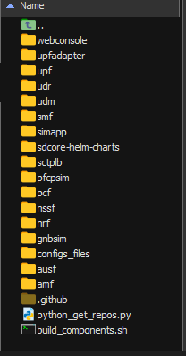
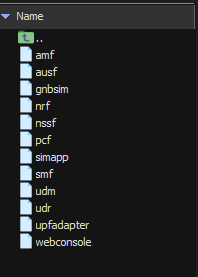
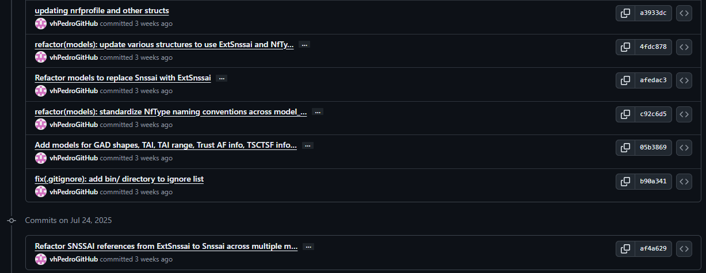
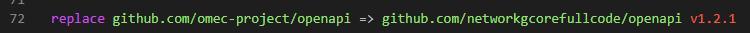

# Informe Técnico

## Índice

- [Introducción](#introducción)
- [Para desarrollo](#pasos-iniciales)
  - [Instalaciones necesarias](#instalaciones-necesarias)
  - [Clonar repositorios](#clonar-repositorios)
  - [Construir componentes](#construir-componentes)
  - [Obtener builds](#obtener-builds)
  - [Ejecutar componentes individualmente](#ejecutar-componentes-individualmente)
  - [Entorno de docker](#entorno-de-docker)
  - [Comandos útiles](#comandos-útiles)

- [Kubernetes Environment](#kubernetes-environment)
  - [Aether OnRamp](#aether-onramp)
  - [Kubernetes para desarrollo](#kubernetes-para-desarrollo)
    - [Requisitos](#requisitos)
    - [Instalación-del-entorno-de-kubernetes](#instalación-del-entorno-de-kubernetes)
    - [Trabajando con Helm](#trabajando-con-helm)
      - [Instalación de Helm](#instalando-helm)
      - [Obtener y operar Helm Charts](#obtener-y-operar-charts)
      - [Utils](#utils)
    - [Comandos para eliminar kubernetes](#comandos-para-eliminar-kubernetes)
- [Ejemplos de desarrollo](#ejemplos-de-desarrollo)
- [Pruebas de simulación y trazas de logs de registro](#pruebas-de-simulación-y-trazas-de-logs-de-registro)

## Introducción

Este informe técnico recopila todo lo realizado para tener un entorno de desarrollo que nos permita integrar nuevos cambios a los elementos presentados por Aether.

Para trabajar según nuestras necesidades, hicimos forks de algunos de los repositorios de Aether, los cuales se pueden encontrar en los siguientes enlaces:

GitHub repository for the OMEC Project ([https://github.com/omec-project](https://github.com/omec-project)): Microservicios para SD-Core, además del emulador (gNBsim) que somete SD-Core a cargas de trabajo RAN.

GitHub repository for the ONOS Project ([https://github.com/onosproject](https://github.com/onosproject)): Microservicios para SD-RAN y ROC, además de los modelos YANG utilizados para generar la API de Aether.

GitHub repository for the ONF: [https://github.com/opennetworkinglab](https://github.com/opennetworkinglab) — Documentación de OnRamp y playbooks para desplegar Aether.

Los forks se pueden encontrar en [este enlace](https://github.com/orgs/networkgcorefullcode/repositories).

En nuestro caso, editamos el CI para adecuarlo a nuestras necesidades.

Al hacer forks, podemos contribuir en un futuro al proyecto.

Las imágenes de Docker se guardan en Docker Hub. Si se busca "network5gcore" en Docker Hub, deben aparecer las imágenes.

---

## Pasos iniciales

Objetivo: construir las imágenes de cada uno de los componentes de Aether, utilizando nuestra configuración para crear un entorno válido para el desarrollo. Hacer ese entorno utilizando solo Docker.

### Instalaciones necesarias

Las instalaciones necesarias son las siguientes:

- [Go](https://go.dev/doc/install)
- [Docker](https://docs.docker.com/engine/install/ubuntu/)
- [Kubectl](https://kubernetes.io/docs/tasks/tools/install-kubectl-linux/)
- [Minikube](https://minikube.sigs.k8s.io/docs/start/?arch=%2Fwindows%2Fx86-64%2Fstable%2F.exe+download)
- Python versión >= 3.8

Comandos para instalar Go en Linux Ubuntu 22.04:

```bash
cd ~
wget https://go.dev/dl/go1.24.6.linux-amd64.tar.gz
sudo rm -rf /usr/local/go && sudo tar -C /usr/local -xzf go1.24.6.linux-amd64.tar.gz
export PATH=$PATH:/usr/local/go/bin
go version
```

### Clonar repositorios

En nuestro entorno, ejecutar los siguientes comandos:

```bash
cd ~
mkdir aether-forks
cd aether-forks
```

Crear aquí el archivo `python_get_repos.py`:

```bash
touch python_get_repos.py
```

Copiar el siguiente código (para clonar todos los repositorios rápidamente):

```python
import requests
import os

user = "networkgcorefullcode"  # Reemplaza con el nombre de usuario
url = f"https://api.github.com/users/{user}/repos?per_page=100"
repos = requests.get(url).json()

for repo in repos:
  os.system(f"git clone {repo['clone_url']}")
```

```bash
python3 python_get_repos.py
```

Después de que termine la ejecución del script, tendremos las siguientes carpetas:



Actualmente, al clonar los repositorios se clonará el repositorio utilFiles, en el cual se encuentran definidos varios de los archivos que mencionamos aquí. Para poder utilizar estos archivos, deberemos copiar su contenido en la raíz donde se encuentran todos los demás repositorios. Así los podremos utilizar sin problemas.

### Construir componentes

Crear el script `build_components.sh`:

```bash
touch build_components.sh
sudo chmod 700 build_components.sh
```

```bash
#!/bin/bash

for dir in "$PWD"/*/; do
  [ -d "$dir" ] && echo "Directorio: $dir"
  if (cd "$dir" && make all); then
    :
  else
    echo "Error al ejecutar make all"
  fi
done
```

Ejecutar el script para crear los builds de cada componente:

```bash
./build_components.sh
```

### Obtener builds

Crear el script `get_builds.sh`:

```bash
touch get_builds.sh
sudo chmod 700 get_builds.sh
```

```bash
#!/bin/bash

# Guardar el directorio actual en una variable
current_dir="$PWD"

# Recorre todos los directorios en la raíz del script
for dir in "$current_dir"/* ; do
  echo "Revisando $dir"
  # Verifica si existe la carpeta bin dentro del directorio
  if [ -d "$dir/bin" ]; then
    # Copia el contenido de bin al directorio actual
    cp -r "$dir/bin/" "$current_dir"
    echo "Contenido de $dir/bin copiado a $current_dir"
  fi
done
```

Este script copiará todos los builds de Go en una carpeta llamada bin.

```bash
./get_builds.sh
```



Binario de cada uno de los componentes

## Ejecutar componentes individualmente

Para ejecutar los componentes individualmente y hacer pruebas en cada uno de ellos, podemos hacer lo siguiente:

1. Asegurarnos de que el componente que queremos ejecutar tenga su binario en la carpeta `bin`.
2. Abrir una terminal y navegar a la carpeta `bin` donde se encuentran los binarios de los componentes.
3. Ejecutar el binario del componente deseado. Por ejemplo, si queremos ejecutar el componente `amf`, podemos usar el siguiente comando:

```bash
cd ~/aether-forks/bin
```

```bash
./amf --cfg ~/aether-forks/configs_files/amfcfg.yaml
```

Así para cada uno de los componentes que soporten una configuración inicial a través de un archivo YAML de configuración.

Esto nos permitirá probar cada componente de forma individual y verificar su funcionamiento antes de integrarlos en un entorno más complejo como Docker o Kubernetes. Es especialmente útil para el desarrollo y la depuración de cada componente por separado.

## Entorno de Docker

Para crear un entorno de desarrollo utilizando Docker, podemos utilizar un archivo `docker-compose.yaml` que defina los servicios necesarios para ejecutar los componentes de Aether. A continuación se muestra un ejemplo básico de cómo podría ser este archivo:

En la carpeta `configs_files/` se deben colocar los archivos de configuración YAML para cada componente, como `amfcfg.yaml`, `ausfcfg.yaml`, etc. Estos archivos deben contener la configuración específica para cada componente.

En el repositorio `utilFiles` actualmente hay una serie de docker-compose y scripts que levantan un entorno de Docker, según las configuraciones asociadas en `configs_files`.

Hasta ahora todo es una prueba, la configuración puede que no sea estable, cualquier corrección de la misma será bienvenida. La idea es tener el entorno de prueba sin problemas, que sea fácil desarrollar y comprobar los resultados en nuestro entorno.

## Comandos útiles

- Para detener todos los contenedores:

```bash
docker compose down
```

- Para ver los logs de un contenedor específico:

```bash
docker compose logs <nombre_del_contenedor>
```

- Para ejecutar comandos dentro de un contenedor en ejecución:

```bash
docker exec -it <nombre_del_contenedor> <comando>
```

Por ejemplo, para abrir una terminal bash en el contenedor `amf`:

```bash
docker exec -it amf /bin/bash
```

- Para reconstruir los contenedores después de hacer cambios en el código:

```bash
docker compose up -d --build
```

Si necesitas instalar utilidades adicionales como `vim`, `strace`, `net-tools`, `curl`, `netcat-openbsd` y `bind-tools` en un contenedor basado en Alpine Linux, puedes ejecutar el siguiente comando dentro del contenedor:

```bash
apk update && apk add --no-cache -U vim strace net-tools curl netcat-openbsd bind-tools
```

Esto actualizará los índices de paquetes e instalará las herramientas necesarias sin guardar archivos temporales, manteniendo la imagen ligera.

Script para instalar herramientas en los contenedores core 5G:

```bash
#!/bin/bash

# Lista de contenedores core 5G según docker-compose
core5g_containers=(amf ausf nrf nssf pcf smf udm udr)

for c in "${core5g_containers[@]}"; do
  echo "Instalando herramientas en $c..."
  docker exec -it "$c" sh -c "apk update && apk add --no-cache -U vim strace net-tools curl netcat-openbsd bind-tools"
done
```

## Kubernetes Environment

En las siguientes secciones se abordarán configuraciones relacionadas a un entorno de Kubernetes, ambiente donde Aether fue diseñado para desplegarse.

## Aether OnRamp

### Imágenes de Docker

Para desplegar los componentes de Aether actualizados, es necesario tener las imágenes de cada NF. Para ello se realizaron los siguientes pasos:

1. En el repositorio de cada NF se editó el archivo `VERSION` y se cambió a un valor personalizado, en este caso fue: `v1.2.1-new-dev`.

2. En el archivo `Makefile` se completaron las siguientes variables:
```makefile
DOCKER_REGISTRY ?= 192.168.12.15:8083/
DOCKER_REPOSITORY ?= omecproject/
```

- `DOCKER_REGISTRY` se configuró con el valor del registry privado de Docker que se encuentra desplegado en un servidor Nexus en los servidores de la empresa.
- `DOCKER_REPOSITORY` se configuró con el nombre del repositorio por defecto de Aether SD-Core.

3.  Hacer un `docker build` para construir las imágenes y luego un `docker push` para subirlas al registry. Para hacer el *push* es necesario primero iniciar sesión en el Nexus con `docker login 192.168.12.15:8083`.

Todos estos pasos pueden adaptarse según la conveniencia del usuario, usar una versión diferente o subir las imágenes a otro registry de Docker.


### Configuración del *values* de Helm

El archivo de *values* de Helm se encuentra en la siguiente ruta, partiendo desde el directorio raíz del repositorio de Aether OnRamp: `/deps/5gc/roles/core/templates/sdcore-5g-values.yaml`.

En este archivo se hicieron varias configuraciones:

1. Se configuró el despliegue para que bajara las imágenes actualizadas del registry privado en Nexus de la siguiente forma:

```yaml
5g-control-plane:
  enable5G: true
  images:
    repository: "192.168.12.15:8083/"
    tags:
      amf: omecproject/5gc-amf:v1.2.1-new-dev
      ausf: omecproject/5gc-ausf:v1.2.1-new-dev
      smf: omecproject/5gc-smf:v1.2.1-new-dev
      udm: omecproject/5gc-udm:v1.2.1-new-dev
      udr: omecproject/5gc-udr:v1.2.1-new-dev
      pcf: omecproject/5gc-pcf:v1.2.1-new-dev
      nrf: omecproject/5gc-nrf:v1.2.1-new-dev
      webui: omecproject/5gc-webui:v1.2.1-new-dev
      sctplb: omecproject/sctplb:v1.2.1-new-dev
      nssf: omecproject/5gc-nssf:v1.2.1-new-dev
      upfadapter: omecproject/upfadapter:v1.2.2-new-dev


# otras configuraciones....

omec-sub-provision:
  enable: true
  images:
    repository: "192.168.12.15:8083/"
    tags:
      simapp: omecproject/simapp:v1.2.1-new-dev


# otras configuraciones....

omec-user-plane:
  enable: true
  nodeSelectors:
    enabled: true
  resources:
    enabled: false
  images:
    repository: "192.168.12.15:8082/"
     #tags:
       #bess: omecproject/upf-epc-bess:v1.2.1-new-dev
       #pfcpiface: omecproject/upf-epc-pfcpiface:v1.2.1-new-dev
      # tools: omecproject/busybox:stable

# otras configuraciones....

```
- Es importante destacar que el `tag` definido para cada imagen debe contener la siguiente estructura debido a que así es como se estructura la imagen en el registry
```
omecproject/5gc-<nombre del componente en minúscula>:<valor definido en el archivo VERSION del repo del componente>
```
- Por ahora los despliegues se han hecho manteniendo el plano de usuario original de Aether, como se puede observar las imágenes actualizadas de esa sección están definidas pero comentadas.

2. Se añadieron configuraciones para varias NFs (AUSF, UDM, UDR) y fueron modificadas otras (WebUI, AMF, NRF, entre otras). En este documento no se detallará cada configuración debido a que sería demasiado extenso. Para una inspección completa puede acceder al archivo [aquí](https://gitlab.generalsoftwareinc.com/5g/aether/-/blob/feature/update-aether/deps/5gc/roles/core/templates/sdcore-5g-values.yaml?ref_type=heads).

3. Debido a que se están usando componentes de Aether más actualizados (no solo por este proyecto sino también por desarrolladores oficiales de Aether) existen procesos nuevos. Uno de ellos es que ahora las NFs hacen un *polling* periódico al **WebUI** por el puerto `5001`. Es por eso que cada NF debe tener esta configuración:
```yaml
 webuiUri: "http://webui:5001"
```
El manifiesto del ***service*** del **WebUI** no tiene este puerto configurado, por lo que se hizo necesario aplicar una solución que permitiera exponer el puerto y hacer permanente este cambio. Para ello se utilizó [Kustomize](https://kustomize.io), que permite aplicar modificaciones a manifiestos de Kubernetes. Kustomize tiene definido en un archivo la nueva configuración para el *service* del WebUI y la aplica como un parche al manifiesto final que se renderiza con Helm. Este proceso está incluido en el despliegue del 5GC con Ansible.


## Kubernetes para desarrollo

### Requisitos

- Ubuntu Server versión 22.04 o superior
- Docker
- Kubernetes
- Go versión 1.24.4 o superior

---

### Instalación del entorno de Kubernetes

---

Para desplegar Aether debemos tener un entorno de Kubernetes, en el cual utilizando los diferentes charts de Helm desplegaremos los diferentes servicios.

####  1. **Preparar el servidor**

Asegúrate de que tu servidor tenga al menos:

- 2 CPUs (4 si vas a desplegar Aether)
- 4–8 GB de RAM (mejor con 8 GB para SD-Core)
- 20+ GB de almacenamiento
- Sistema operativo Ubuntu Server 22.04 LTS
- Seguridad: grupo de seguridad con puertos abiertos (SSH, 6443, 80, 443, 22, etc.)

---

#### 2. **Configurar el entorno base**

```bash
# Actualizar paquetes
sudo apt update && sudo apt upgrade -y

# Desactivar swap (requisito de kubeadm)
sudo swapoff -a
sudo sed -i '/ swap / s/^/#/' /etc/fstab
```

---

####  3. **Instalar Docker (container runtime)**

```bash
sudo apt install -y apt-transport-https ca-certificates curl software-properties-common

curl -fsSL https://download.docker.com/linux/ubuntu/gpg | sudo gpg --dearmor -o /etc/apt/keyrings/docker.gpg

echo \
  "deb [arch=$(dpkg --print-architecture) signed-by=/etc/apt/keyrings/docker.gpg] https://download.docker.com/linux/ubuntu \
  $(lsb_release -cs) stable" | \
  sudo tee /etc/apt/sources.list.d/docker.list > /dev/null

sudo apt update
sudo apt install -y docker-ce docker-ce-cli containerd.io

# Habilitar Docker
sudo systemctl enable docker
sudo systemctl start docker

sudo usermod -aG docker $USER
```

---

####  4. **Instalar Kubernetes (kubeadm, kubelet, kubectl)**

```bash
sudo apt-get update -y
# apt-transport-https may be a dummy package; if so, you can skip that package
sudo apt-get install -y apt-transport-https ca-certificates curl gpg

# If the directory `/etc/apt/keyrings` does not exist, it should be created before the curl command, read the note below.
# sudo mkdir -p -m 755 /etc/apt/keyrings
curl -fsSL https://pkgs.k8s.io/core:/stable:/v1.33/deb/Release.key | sudo gpg --dearmor -o /etc/apt/keyrings/kubernetes-apt-keyring.gpg

# This overwrites any existing configuration in /etc/apt/sources.list.d/kubernetes.list
echo 'deb [signed-by=/etc/apt/keyrings/kubernetes-apt-keyring.gpg] https://pkgs.k8s.io/core:/stable:/v1.33/deb/ /' | sudo tee /etc/apt/sources.list.d/kubernetes.list

sudo apt-get update -y
sudo apt-get install -y kubelet kubeadm kubectl
sudo apt-mark hold kubelet kubeadm kubectl

sudo systemctl enable --now kubelet
```

---

####  5. **Inicializar el clúster (modo single-node para pruebas)**

```bash
# (opcional) Usa tu IP pública o privada como advertise address
sudo kubeadm init \
  --pod-network-cidr=192.168.0.0/16 \
  --apiserver-advertise-address=$(hostname -I | awk '{print $1}') \
  --cri-socket=/var/run/containerd/containerd.sock

```

>  Esto instalará un clúster con Calico/Flannel-compatible pod CIDR.

Si presentar problemas relacionados con que no encuentra el containerd.sock, puedes hacer lo siguiente:

Asegúrate de que containerd esté instalado

```bash
which containerd
```

Debe devolver algo como:

```bash
/usr/bin/containerd
```

Asegúrate de que containerd esté corriendo

```bash
sudo systemctl status containerd
```

Si no está corriendo, intenta:

```bash
sudo systemctl start containerd
```

Verifica que el archivo de configuración de containerd tenga habilitado el CRI

Ejecuta:

```bash
sudo containerd config default | sudo tee /etc/containerd/config.toml > /dev/null
```

Luego edita el archivo:

```bash
sudo nano /etc/containerd/config.toml
```

Busca esta sección:

```toml
[plugins."io.containerd.grpc.v1.cri"]
```

> Asegúrate de que no esté comentada y que esté habilitada. También asegúrate de que tenga:

```toml
  [plugins."io.containerd.grpc.v1.cri".containerd.runtimes.runc.options]
    SystemdCgroup = true
```

Reinicia containerd después de los cambios

```bash
sudo systemctl restart containerd
```

Verifica el socket
Asegúrate de que el socket exista:

```bash
ls -l /var/run/containerd/containerd.sock
```

> Debe aparecer como archivo tipo socket.

Vuelve a intentar la inicialización

```bash
sudo kubeadm init \
  --pod-network-cidr=192.168.0.0/16 \
  --apiserver-advertise-address=$(hostname -I | awk '{print $1}') \
  --cri-socket=/var/run/containerd/containerd.sock
```

---

#### 6. **Configurar el entorno para el usuario actual**

```bash
mkdir -p $HOME/.kube
sudo cp -i /etc/kubernetes/admin.conf $HOME/.kube/config
sudo chown $(id -u):$(id -g) $HOME/.kube/config
```

---

####  7. **Instalar red de pods (ej. Calico)**

```bash
# Usando Calico como red de pods
kubectl apply -f https://raw.githubusercontent.com/projectcalico/calico/v3.27.0/manifests/calico.yaml
```

---

####  8. **Permitir que el nodo actúe como master y worker (modo prueba)**

```bash
kubectl taint nodes --all node-role.kubernetes.io/control-plane-
```

Esto es necesario si solo tienes **una máquina** y quieres que los pods de usuario (como Aether) se ejecuten ahí.

---

#### 9. **Verifica que todo está funcionando**

```bash
kubectl get nodes
kubectl get pods -A
```

Debes ver algo como esto:


### Trabajando con Helm

#### Instalando Helm

Ejecuta:

```bash
curl -fsSL -o get_helm.sh https://raw.githubusercontent.com/helm/helm/main/scripts/get-helm-3
chmod 700 get_helm.sh
./get_helm.sh
```

#### Obtener y operar charts

Aether proporciona una serie de charts de helm, los cuales podemos configurar segun nuestras necesidades. Estos charts los podemos encontrar en:

[https://charts.aetherproject.org](https://charts.aetherproject.org)

[https://charts.onosproject.org](https://charts.onosproject.org)

[https://charts.opencord.org](https://charts.opencord.org)

[https://charts.atomix.io](https://charts.atomix.io)

[https://sdrancharts.onosproject.org](https://sdrancharts.onosproject.org)

[https://charts.rancher.io/](https://charts.rancher.io/)

Los repos de github son los siguientes:

ROC: [https://github.com/onosproject/roc-helm-charts](https://github.com/onosproject/roc-helm-charts)

SD-RAN: [https://github.com/onosproject/sdran-helm-charts](https://github.com/onosproject/sdran-helm-charts)

SD-Core: [https://github.com/omec-project/sdcore-helm-charts](https://github.com/omec-project/sdcore-helm-charts).

De estos repos hicimos repositorio para trabajar segun nuestras necesidades.

SD-Core: [https://github.com/networkgcorefullcode/helm-charts](https://github.com/networkgcorefullcode/sdcore-helm-charts).

Ejecutar los siguientes comandos:

Opcionales:

```bash
helm repo add stable https://charts.helm.sh/stable                        
helm repo add cord https://charts.opencord.org                          
helm repo add atomix https://charts.atomix.io                             
helm repo add onosproject https://charts.onosproject.org                       
helm repo add sdran https://sdrancharts.onosproject.org                  
helm repo add aether https://charts.aetherproject.org                     
helm repo add cetic https://cetic.github.io/helm-charts                  
helm repo add bitnami https://charts.bitnami.com/bitnami
helm repo update

helm search repo onos

## para revertir esto
helm repo remove stable
helm repo remove cord
helm repo remove atomix
helm repo remove onosproject
helm repo remove sdran
helm repo remove aether
helm repo remove cetic
helm repo remove bitnami
```

```bash
kubectl apply -f https://raw.githubusercontent.com/rancher/local-path-provisioner/master/deploy/local-path-storage.yaml
kubectl patch storageclass local-path -p '{"metadata": {"annotations":{"storageclass.kubernetes.io/is-default-class":"true"}}}'
```

Ejecutar los siguientes comandos desde el directorio `helm-charts/`:

```bash
helm dependency build atomix-1.1.2/chart
helm dependency build onos-operator
cd aether-roc-umbrella
rm Chart.lock
helm dependency build .
cd ..
cd sd-core
rm Chart.lock
helm dependency build .
cd ..
```

Ejecutar ahora:

```bash
helm install -n kube-system atomix atomix-1.1.2/chart
helm install -n kube-system onos-operator onos-operator
kubectl create namespace roc5g
kubectl create namespace sdcore
kubectl apply -f https://raw.githubusercontent.com/k8snetworkplumbingwg/multus-cni/master/deployments/multus-daemonset.yml
kubectl get crd network-attachment-definitions.k8s.cni.cncf.io
kubectl label node <node_name> node-role.aetherproject.org=omec-upf

cd ~
git clone https://github.com/containernetworking/plugins.git
cd plugins
sudo chmod +x build_linux.sh
./build_linux.sh
```

Ahora ejecutar los siguientes comandos de helm para desplegar el core 5G. Deberemos de estar en el repo helm-charts para ejecutar estos comandos.

```bash

# Desplegar el core 5G
helm install -n sdcore core5g sd-core

```

Si los servicios relacionados con mongodb no estan funcionando asegurate de que se descargaron los charts como dependencias prueba ejecutar este comando en cada uno de los charts que hay como dependencia.

```bash
# dirigete a sd-core/charts
cd sd-core/charts

charts=("5g-control-plane" "5g-ran-sim" "bess-upf" "omec-control-plane" "omec-sub-provision")

for chart in "${charts[@]}"; do
    helm dependency build "$chart"
    helm dependency update "$chart"
done

cd ..
cd ..
```

El webui es un componente principal para el funcionamiento del core 5g de Aether, en este despliegue se puede retrasar su despliegue con frecuencia y provocar problemas en los demas componentes, para solucionar esto pasado un tiempo deberemos eliminar cada uno de los componentes del core para que el deployment los vuelva a reiniciar y ahora con el webui en funcionamiento las cosas funcionen mejor. Los siguientes comandos realizan esa acción.

```bash
# Puedes usar un comando kubectl para listar todos los pods excepto el webui:

kubectl get pods -n sdcore | grep -v webui | grep -v mongodb | grep -v kafka | grep -v core5g-zookeeper

# Usa el siguiente comando para eliminar todos los pods excepto el webui:

kubectl get pods -n sdcore | grep -v webui | grep -v mongodb | grep -v kafka | grep -v core5g-zookeeper | awk '{print $1}' | xargs kubectl delete pod -n sdcore
```

#### Utils

Para habilitar una instancia de mongodb express que nos provea de una interfaz web para visualizar facilmente la base de datos mongodb. Crear y guardar esto en un nuestro entorno

```yml
apiVersion: v1
kind: Service
metadata:
  name: mongodb
spec:
  selector:
    app.kubernetes.io/name: mongodb
  ports:
    - port: 27017
      targetPort: 27017
---
apiVersion: apps/v1
kind: Deployment
metadata:
  name: mongo-express
spec:
  replicas: 1
  selector:
    matchLabels:
      app: mongo-express
  template:
    metadata:
      labels:
        app: mongo-express
    spec:
      containers:
        - name: mongo-express
          image: mongo-express:latest
          ports:
            - containerPort: 8081
          env:
            - name: ME_CONFIG_MONGODB_SERVER
              value: "mongodb"  # Nombre del servicio de MongoDB
            - name: ME_CONFIG_MONGODB_PORT
              value: "27017"
            - name: ME_CONFIG_BASICAUTH_USERNAME
              value: "admin"
            - name: ME_CONFIG_BASICAUTH_PASSWORD
              value: "admin123"
---
apiVersion: v1
kind: Service
metadata:
  name: mongo-express
spec:
  type: NodePort
  selector:
    app: mongo-express
  ports:
    - port: 8081
      targetPort: 8081
      nodePort: 30081
```

Ejecutar el comando apply correspondiente

```bash
kubectl apply -f <file_name> -n <name_space>
```

Revisar los logs y verificar que todo funcione correctamente, si hay errores en el despliegue, se debe revisar la configuracion proporcionada en el helm chart correspondiente.

Puertos de los servicios

| Servicio           | Puerto | Descripción                               |
|--------------------|--------|-------------------------------------------|
| webui              | 30001  | Interfaz para el Webui                    |
| mongodb-express    | 30081  | Interfaz web para interactuar con mongodb |

Para ejecutar el user-plane en una instancia EC2 de AWS, seguir los siguientes pasos

1. **Requisitos de red (VPC prerequisites)**

   - Crear una VPC con tres subredes: `mgmt`, `access` y `core`.
   - Hacer accesibles a internet las subredes `mgmt` y `core`.
   - Configurar rutas (incluyendo para eNB/gNB si están en on-premise).
   - Crear interfaces de red (ENIs) para `access` y `core`, desactivar el *source/destination check* en `core` y añadir ruta para la subred de UEs.

2. **Lanzar la instancia EC2**

   - Usar un tipo con **ENA** habilitado (ej. `c5.2xlarge`) y AMI Ubuntu 20.04.
   - Inicialmente conectar solo la subred `mgmt`, y luego añadir las ENIs de `access` y `core`.

3. **Configurar el sistema operativo**

   - Habilitar **HugePages de 1Gi** modificando GRUB.
   - Cargar y configurar el driver **vfio-pci** con modo *unsafe IOMMU*.
   - Asociar las interfaces `access` y `core` al driver vfio-pci usando `driverctl`.

4. **Configurar Kubernetes (K8S)**

   - Instalar **Multus CNI**.
   - Instalar y configurar el **SR-IOV device plugin** para las interfaces de `access` y `core` (asignadas por PCI).
   - Verificar recursos disponibles: HugePages y dispositivos SR-IOV.
   - Instalar el binario `vfioveth` en `/opt/cni/bin`.

5. **Instalar BESS-UPF**

   - Requiere helm chart con licencia de miembros ONF.
   - Usar un `overriding-values.yaml` con configuración de subredes, direcciones IP, MAC y recursos SR-IOV.
   - Desplegar con `helm install` y verificar que el pod `upf-0` esté en estado *Running*.

#### Preparación para un entorno EC2 AWS

Preparación del VPC

---

1️⃣ Crear la **VPC**

1. Ve a **VPC → Your VPCs → Create VPC**.
2. Modo: **VPC only**.
3. Nombre: `upf-vpc`.
4. IPv4 CIDR: por ejemplo `10.0.0.0/16`.
5. Crear.

---

2️⃣ Crear las **subredes**

Necesitamos **tres subnets** dentro de la misma VPC:

- **mgmt** → para administrar la instancia (acceso SSH, K8s API, etc.)
- **access** → tráfico hacia/desde gNB/eNB
- **core** → tráfico hacia el core de red (internet o N6)

Ejemplo:

| Nombre | CIDR        | Zona AZ    |
| ------ | ----------- | ---------- |
| mgmt   | 10.0.1.0/24 | us-east-1a |
| access | 10.0.2.0/24 | us-east-1a |
| core   | 10.0.3.0/24 | us-east-1a |

En la consola:

1. **VPC → Subnets → Create subnet**
2. Selecciona `upf-vpc` y crea las 3 subnets con sus CIDRs.

---

3️⃣ Hacer accesibles a Internet las subredes **mgmt** y **core**

Hay varias formas:

- Opción fácil: asignarlas a un **Internet Gateway**.
- Opción del ejemplo: usar **NAT Gateway** en una subred pública.

Ejemplo con NAT Gateway:

1. **VPC → Internet Gateways → Create internet gateway** → Adjuntar a `upf-vpc`.
2. Crea una **subred pública** extra, ej. `10.0.10.0/24`, con **Auto-assign Public IPv4** habilitado.
3. **Elastic IPs** → reservar una IP y usarla al crear el NAT Gateway.
4. **VPC → NAT Gateways → Create NAT Gateway** en la subred pública.
5. En las **Route Tables** de `mgmt` y `core`:

   - Añadir ruta `0.0.0.0/0` → hacia el **NAT Gateway** esto en las routes table de core
   - Añadir ruta `0.0.0.0/0` → hacia el **Internet Gateway** esto en las routes table de mgmt

---

4️⃣ Configurar rutas para **access**

Si tienes gNB/eNB **on-premise**:

- Ve a **Route Tables** de `access` y añade rutas hacia las redes de las estaciones base, apuntando al gateway correcto (VPN, Direct Connect, etc.).

---

5️⃣ Crear **ENIs** para access y core

1. **EC2 → Network Interfaces → Create network interface**.

   - Para `access`: subnet `access`, sin IP pública.
   - Para `core`: subnet `core`, sin IP pública.
2. Guarda los **IDs** de cada ENI (los usarás luego para adjuntarlos a la EC2).

---

6️⃣ Desactivar **source/destination check** en la ENI de core

Esto permite que la interfaz enrute tráfico que no sea solo para ella.

1. Selecciona la ENI de `core`.
2. **Actions → Change source/dest. check → Disable**.

---

7️⃣ Añadir ruta para la **UE pool subnet**

Esto es para que el tráfico hacia los UEs pase por la interfaz core.

1. Ve a la **Route Table** de la subred pública o la que use el internet/NAT.
2. Añade ruta:

   - Destination: `SUBRED_UE_POOL` (ej. `10.22.0.128/26`)
   - Target: **ENI core**.

---

Preparación de la instancia EC2

---

#### **1️⃣ Lanzar la instancia EC2**

1. Ve a **AWS Console → EC2 → Launch instance**.
2. **Name**: por ejemplo `ec2-server`.
3. **AMI**: selecciona **Ubuntu Server 22.04 LTS (64-bit x86)**.
4. **Instance type**: selecciona **c5.2xlarge** (o cualquier tipo con ENA habilitado y suficiente rendimiento).
5. **Key pair**: selecciona o crea uno para poder conectarte por SSH.

---

#### **2️⃣ Configurar red inicial (solo `mgmt`)**

1. En **Network settings**:

   - **VPC**: selecciona la que creaste (`upf-vpc` o el nombre que tenga).
   - **Subnet**: elige **solo la subred mgmt** (la que tiene acceso a Internet o NAT Gateway).
   - **Auto-assign Public IP**: habilitado, para que puedas conectarte por SSH.
2. En **Security group**:

   - Asegúrate de permitir **SSH (TCP 22)** desde tu IP.

---

### 3️⃣ Lanzar y conectarte

- Haz clic en **Launch instance**.
- Conéctate por SSH a la IP pública:

```bash
ssh -i tu_clave.pem ubuntu@IP_PUBLICA
```

---

**4️⃣ Crear y adjuntar las ENIs de `access` y `core`**

Esto se hace después de que la instancia está corriendo

1. Ve a **EC2 → Network Interfaces → Create network interface**. Esto se indico en los pasos anteriores

   - **Name**: `eni-access`.
   - **Subnet**: subred `access`.
   - **Auto-assign Public IP**: desactivado (solo se necesita en `mgmt`).
   - Crea otra igual pero para `core` (`eni-core`).

2. **Desactivar Source/Destination Check** en la ENI `core`:

   - Selecciona la ENI `eni-core`.
   - En **Actions → Change source/dest. check → Disable**.

3. **Adjuntar las ENIs a la instancia**:

   - En la ENI `eni-access`, ve a **Actions → Attach** y elige tu instancia.
   - Repite para `eni-core`.

---

#### 5️⃣ Verificar desde el SO

Dentro de la instancia, ejecuta:

```bash
ip addr
```

Deberías ver:

- `ens5` → interfaz de `mgmt` (con IP pública o detrás de NAT).
- Otra interfaz para `access`.
- Otra interfaz para `core`.

---

Configuracion del sistema

SSH a la máquina virtual y actualiza Grub para habilitar HugePages de 1Gi.

```bash
$ sudo vi /etc/default/grub
# Edit grub command line
GRUB_CMDLINE_LINUX="transparent_hugepage=never default_hugepagesz=1G hugepagesz=1G hugepages=2"

$ sudo update-grub
```

Carga el controlador vfio-pci y habilita el modo unsafe IOMMU.

``` bash
sudo su -
modprobe vfio-pci
echo "options vfio enable_unsafe_noiommu_mode=1" > /etc/modprobe.d/vfio-noiommu.conf
echo "vfio-pci" > /etc/modules-load.d/vfio-pci.conf
reboot
```

Después de reiniciar, verifica los cambios.

```bash
$ cat /proc/meminfo | grep Huge
# AnonHugePages:         0 kB
# ShmemHugePages:        0 kB
# FileHugePages:         0 kB
# HugePages_Total:       2
# HugePages_Free:        2
# HugePages_Rsvd:        0
# HugePages_Surp:        0
# Hugepagesize:    1048576 kB
# Hugetlb:         4194304 kB

$ cat /sys/module/vfio/parameters/enable_unsafe_noiommu_mode
# Y
```

Por último, asocia las interfaces `access` y `core` al controlador vfio.  
Antes de continuar, toma nota de las direcciones MAC de las dos ENIs, ya sea desde el panel de EC2 o usando el comando `aws ec2 describe-network-interfaces`.  
Estas direcciones MAC son necesarias para identificar la dirección PCI de cada interfaz.

```bash
# Find interface name of the access and core subnet ENIs by comparing the MAC address
$ ip link show ens6
$ ip link show ens7

# Find PCI address of the access and core subnet ENIs
$ lshw -c network -businfo
Bus info          Device           Class      Description
=========================================================
pci@0000:00:05.0  ens5             network    Elastic Network Adapter (ENA)
pci@0000:00:06.0  ens6             network    Elastic Network Adapter (ENA) # access in this example
pci@0000:00:07.0  ens7             network    Elastic Network Adapter (ENA) # core in this example

# Install driverctl
$ sudo apt update
$ sudo apt install driverctl

# Check current driver
$ sudo driverctl -v list-devices | grep -i net
0000:00:05.0 ena (Elastic Network Adapter (ENA))
0000:00:06.0 ena (Elastic Network Adapter (ENA))
0000:00:07.0 ena (Elastic Network Adapter (ENA))

# Bind access and core interfaces to vfio-pci driver
$ sudo driverctl set-override 0000:00:06.0 vfio-pci
$ sudo driverctl set-override 0000:00:07.0 vfio-pci

# para revertir
sudo driverctl unset-override 0000:00:06.0
sudo driverctl unset-override 0000:00:07.0

# Verify
$ sudo driverctl -v list-devices | grep -i net
# 0000:00:05.0 ena (Elastic Network Adapter (ENA))
# 0000:00:06.0 vfio-pci [*] (Elastic Network Adapter (ENA))
# 0000:00:07.0 vfio-pci [*] (Elastic Network Adapter (ENA))

$ ls -l /dev/vfio/
# crw------- 1 root root 242,   0 Aug 17 22:15 noiommu-0
# crw------- 1 root root 242,   1 Aug 17 22:16 noiommu-1
# crw-rw-rw- 1 root root  10, 196 Aug 17 21:51 vfio
```

Configurando k8s

La instalación de Kubernetes (K8S) está fuera del alcance de esta guía. Una vez que K8S esté listo en la máquina virtual, deberás instalar `Multus` y `sriov-device-plugin`.

```bash
# Install Multus
$ kubectl apply -f https://raw.githubusercontent.com/k8snetworkplumbingwg/multus-cni/release-3.7/images/multus-daemonset.yml

# Verify
$ kubectl get ds -n kube-system kube-multus-ds
# NAME             DESIRED   CURRENT   READY   UP-TO-DATE   AVAILABLE
# kube-multus-ds   1         1         1       1            1

# Create sriov device plugin config
# Replace PCI address if necessary
$ cat <<EOF | kubectl apply -n kube-system -f -
apiVersion: v1
kind: ConfigMap
metadata:
  name: sriovdp-config
data:
  config.json: |
    {
      "resourceList": [
        {
          "resourceName": "intel_sriov_vfio_access",
          "selectors": {
            "pciAddresses": ["0000:00:06.0"]
          }
        },
        {
          "resourceName": "intel_sriov_vfio_core",
          "selectors": {
            "pciAddresses": ["0000:00:07.0"]
          }
        }
      ]
    }
EOF

# Create sriov device plugin DaemonSet
$ kubectl apply -f https://raw.githubusercontent.com/k8snetworkplumbingwg/sriov-network-device-plugin/v3.3/deployments/k8s-v1.16/sriovdp-daemonset.yaml

# Verify
$ kubectl get ds -n kube-system kube-sriov-device-plugin-amd64
# NAME                             DESIRED   CURRENT   READY   UP-TO-DATE   AVAILABLE
# kube-sriov-device-plugin-amd64   1         1         1       1            1
```

Verifica los recursos asignables en el nodo. Asegúrate de que haya 2 HugePages de 1Gi, 1 `intel_sriov_vfio_access` y 1 `intel_sriov_vfio_core`.

```bash
sudo apt update
sudo apt install jq -y
$ kubectl get node  -o json | jq '.items[].status.allocatable'
# {
#   "attachable-volumes-aws-ebs": "25",
#   "cpu": "7",
#   "ephemeral-storage": "46779129369",
#   "hugepages-1Gi": "2Gi",
#   "hugepages-2Mi": "0",
#   "intel.com/intel_sriov_vfio_access": "1",
#   "intel.com/intel_sriov_vfio_core": "1",
#   "memory": "13198484Ki",
#   "pods": "110"
# }
```

Por último, copia el binario `vfioveth` de CNI en la ruta `/opt/cni/bin` dentro de la máquina virtual.

```bash
sudo wget -O /opt/cni/bin/vfioveth https://raw.githubusercontent.com/opencord/omec-cni/master/vfioveth
sudo chmod +x /opt/cni/bin/vfioveth
```

Instalando bess upf con Helm

En el repo helm-charts hay una rama llamada deploy-ec2, aqui estan los helm-charts modificados, para que todo funcione correctamente en la instancia EC2.

A continuacion edita overriding-values.yaml según tus ip y macs (utiliza vim o nano, tu editor de texto de preferencia).

Verás algo como esto:

```yml
config:
  upf:
    privileged: true
    enb:
      subnet: "10.22.0.128/26"
    access:
      ip: "172.31.67.192/24"
      gateway: "172.31.67.1"
      mac: "02:ee:e9:c8:a5:31"
      resourceName: "intel.com/intel_sriov_vfio_access"
    core:
      ip: "172.31.68.136/24"
      gateway: "172.31.68.1"
      mac: "02:67:74:80:be:35"
      resourceName: "intel.com/intel_sriov_vfio_core"
```

```bash
$ kubectl create namespace bess-upf
$ helm install -n bess-upf bess-upf [path/to/helm/chart] -f overriding-values.yaml
$ kubectl get po -n bess-upf
# NAME    READY   STATUS    RESTARTS   AGE
# upf-0   4/4     Running   0          41h
```

### Comandos para eliminar kubernetes

```bash
sudo systemctl stop kubelet
sudo systemctl stop docker

sudo apt-get purge kubeadm kubectl kubelet kubernetes-cni kube*
sudo apt-get autoremove

# Reiniciar la pc en este paso
sudo rm -rf ~/.kube
sudo rm -rf /etc/kubernetes/
sudo rm -rf /var/lib/etcd/
sudo rm -rf /var/lib/kubelet/
sudo rm -rf /var/lib/dockershim/
sudo rm -rf /var/run/kubernetes/
sudo rm -rf /etc/cni/
sudo rm -rf /opt/cni/
sudo rm -rf /opt/local-path-provisioner

sudo docker system prune -a --volumes

kubectl version
# Debe decir comando no encontrado

kubeadm version
# Debe decir comando no encontrado

sudo rm -rf $HOME/.cache/helm
sudo rm -rf $HOME/.config/helm
sudo rm -rf $HOME/.local/share/helm
```

## Ejemplos de desarrollo

### NRF (NfProfile Update)

El NRF de las versiones estables de Aether, presenta problemas a la hora de integrar nuevos perfiles de red, debido a que faltaban campos que estan presentes en release más modernos del 3GPP. A continuación describiremos el proceso de desarrollo para la actualización del NRF y del modelo NfProfile.

Después de estudiar todas las alternativas para la actualización del NRF se decidió que con actualizar el modelo NfProfile se podrían integrar los nuevos perfiles de red de manera más eficiente, simplemente se deberia hacer un nuevo release de openapi con este modelo actualizado y especificar en cada NF de Aether que deberían utilizar esta nueva versión de openapi actualizada.

Las NF de Aether proporcionan en el registro de su perfil el campo NfServices y en releases más modernos se debe indicar el campo NfServiceList, este campo lo puede completar el NRF en el proceso de registro.

#### Proceso de desarrollo

1. Se actualizó el modelo NfProfile en el repositorio de Aether.

Para esto se generó el openapi correspondiente utilizando el openapi-generator-cli, el cual se encuentra en el repo de openapi. En el repo de nostros openApiFiles/files estan todos los .yaml necesarios para generar el openapi de cada componente. En la actualidad el release 16 tiene todos los .yml organizados hasta el release 16. Lo puedes ver en <https://www.3gpp.org/ftp/specs/archive/OpenAPI/Rel-16>.

En una maquina ubuntu 22.04 o superior debes tener lo siguiente siguiente:

- Java 11 o superior
- Descargar el openapi-generator-cli.jar desde <https://repo1.maven.org/maven2/org/openapitools/openapi-generator-cli/7.6.0/openapi-generator-cli-7.6.0.jar>
- Ejecutar el comando `java -jar openapi-generator-cli.jar help` para verificar que se ha instalado correctamente.
- Generar el openapi de go con los siguientes comandos:

```bash
java -jar openapi-generator-cli.jar generate   -i <path_a_tu_yaml_del_servicio>   -g go   -o ./go-nrf-client
```

En openApiFiles/openApiGeneratorOutputs/go-nrf-client estan todos los archivos generados del cliente de go correspondiente al NRF para el servicio Nnrf_NFManagement.

Para actualizar el NfProfile utilizamos el modelo generado por openapi generator, al se cometió un error que fue copiar y pegar los nuevos modelos generados, como una opción de desarrollo más rápida, pero esto introdujo una serie de bugs que provocaban varios cambios en la estructura original de Aether. El openapi generator genera structs y métodos utilizando una plantilla en común, a veces el código que genera no era lo que necesitaba Aether y se hacían modificaciones manuales según las necesidades. Entonces para evitar estos bugs actualizamos el modelo manualmente, comprobando que solo se agregaran nuevas struct sin romper las anteriores definidas por Aether.

Puedes visitar los siguientes commits donde se hicieron todos los cambios necesarios en el modelo de openapi


2. Se creó un nuevo release de openapi con el modelo actualizado.

Este paso es sencillo simplemente se creó un nuevo tag en la rama main y se hizo un push con ese tag.

3. Se especifica en cada NF de Aether que deben utilizar la nueva versión de openapi

En cada NF de aether se agregaron las siguientes líneas en el archivo de los modulos de go:



Luego se hicieron builds de estas NF para testearlas en nuestros entornos de desarollo

Por último se actualizó el NRF para que llenara el campo NfServiceList en caso de que no llegara ese campo por parte de la NF. Los cambios los puede ver aquí: [Enlace a commit](https://github.com/networkgcorefullcode/nrf/commit/aaaf24b2cec666c1d2bd6cb2b2ad068a4193848f)

### WebUI Update

El WebUI tiene la posibilidad de mostrar y manejar información a través de una página web, haciendo uso de inteligencia artificial se creo una página web para agregar esta posibilidad, también se hicieron modificaciones en como se construye la imagen de docker para habilitar esta funcionalidad. Puede acceder a esta webui utilizando el la dirección y puerto que le asigne para este servicio.

### AMF, SMF, NSSF update to release 2.0.0

Estos componentes aún no tenían integrado nuevas funcionalidades como el polling http al webui para obtener parámetros de configuración. Aether recientemente implementó nuevas funcionalidades para estos componentes, nosotros los hemos actualizado manualmente para agregarle estas nuevas características, estos cambios aún estan en desarrollo y en sus ramas, donde serán probados y luego lanzados en nuevo release.

## Pruebas de simulación y trazas de logs de registro

Utilizando nuestro entorno de desarrollo, pudimos comprobar el correcto funcionamiento de las nuevas características implementadas en Aether, a continuación se detalla mejor como se llevo a cabo este proceso.

#### Configuraciones previas

Primeramente se debe desplegar el Core 5G configurando el archivo `vars/main.yaml` y el archivo `host.ini` con las IPs de los servidores donde seran desplegados Aether y el simulador UERANSIM. 

`vars/main.yml`

```yml
###...otras configuraciones

core:

###...otras configuraciones

  amf:
    ip: "<aether_server_IP>"

ueransim:
  gnb:
    ip: "<ueransim_server_IP>"

###...otras configuraciones

```

`host.ini`

```
[all]
node1 ansible_host=<aether_server_IP> ansible_user=<host_user>
ansible_ssh_private_key_file=<path_to_ssh_private_key>
node2 ansible_host=<ueransim_server_IP> ansible_user=<host_user> ansible_ssh_private_key_file=<path_to_ssh_private_key>

[master_nodes]
node1

[worker_nodes]
#node2
#node3

[gnbsim_nodes]
#node1
#node2
#node4

[oai_nodes]
#node2
#node4

[ueransim_nodes]
node2
#node4

[srsran_nodes]
#node2
#node4
```


#### Despliegue de Aether  y UERANSIM


Para desplegar aether primeramente es necesario instalar Kubernetes con:
```bash
make aether-k8s-install
```


Luego se despliega Aether con:
```bash
make aether-5gc-install
```


Para desplegar UERANSIM se corre el comando:
```bash
make aether-ueransim-install
```


#### Simulación

Para correr la simulación con UERANSIM se debe entrar por ssh a la VM del simulador, y en la carpeta `ueransim/build` correr los siguientes comandos.

Para simular la `gnb`:
```bash
./nr-gnb -c ../config/custom-gnb.yaml
```

Resultado esperado del comando anterior:
```
UERANSIM v3.2.7
[2025-08-13 15:55:46.882] [sctp] [info] Trying to establish SCTP connection... (192.168.12.11:38412)
[2025-08-13 15:55:46.921] [sctp] [info] SCTP connection established (192.168.12.11:38412)
[2025-08-13 15:55:46.921] [sctp] [debug] SCTP association setup ascId[3]
[2025-08-13 15:55:46.921] [ngap] [debug] Sending NG Setup Request
[2025-08-13 15:55:46.926] [ngap] [debug] NG Setup Response received
[2025-08-13 15:55:46.926] [ngap] [info] NG Setup procedure is successful
[2025-08-13 15:56:03.299] [rrc] [debug] UE[1] new signal detected
[2025-08-13 15:56:03.301] [rrc] [info] RRC Setup for UE[1]
[2025-08-13 15:56:03.306] [ngap] [debug] Initial NAS message received from UE[1]
[2025-08-13 15:56:03.961] [ngap] [debug] Initial Context Setup Request received
[2025-08-13 15:56:04.955] [ngap] [info] PDU session resource(s) setup for UE[1] count[1]
[2025-08-13 15:56:08.164] [rls] [debug] UE[1] signal lost
[2025-08-13 15:56:12.658] [rrc] [debug] UE[2] new signal detected
[2025-08-13 15:56:12.658] [rrc] [info] RRC Setup for UE[2]
[2025-08-13 15:56:12.658] [ngap] [debug] Initial NAS message received from UE[2]
[2025-08-13 15:56:12.957] [ngap] [debug] Initial Context Setup Request received
[2025-08-13 15:56:13.355] [ngap] [info] PDU session resource(s) setup for UE[2] count[1]
```


Para simular el UE:
```bash
./nr-ue -c ../config/custom-ue.yaml
```

Resultado esperado del comando anterior:
```
UERANSIM v3.2.7
[2025-08-13 15:56:12.658] [nas] [info] UE switches to state [MM-DEREGISTERED/PLMN-SEARCH]
[2025-08-13 15:56:12.658] [rrc] [debug] New signal detected for cell[1], total [1] cells in coverage
[2025-08-13 15:56:12.658] [nas] [info] Selected plmn[208/93]
[2025-08-13 15:56:12.658] [rrc] [info] Selected cell plmn[208/93] tac[1] category[SUITABLE]
[2025-08-13 15:56:12.658] [nas] [info] UE switches to state [MM-DEREGISTERED/PS]
[2025-08-13 15:56:12.658] [nas] [info] UE switches to state [MM-DEREGISTERED/NORMAL-SERVICE]
[2025-08-13 15:56:12.658] [nas] [debug] Initial registration required due to [MM-DEREG-NORMAL-SERVICE]
[2025-08-13 15:56:12.658] [nas] [debug] UAC access attempt is allowed for identity[0], category[MO_sig]
[2025-08-13 15:56:12.658] [nas] [debug] Sending Initial Registration
[2025-08-13 15:56:12.658] [nas] [info] UE switches to state [MM-REGISTER-INITIATED]
[2025-08-13 15:56:12.658] [rrc] [debug] Sending RRC Setup Request
[2025-08-13 15:56:12.658] [rrc] [info] RRC connection established
[2025-08-13 15:56:12.658] [rrc] [info] UE switches to state [RRC-CONNECTED]
[2025-08-13 15:56:12.658] [nas] [info] UE switches to state [CM-CONNECTED]
[2025-08-13 15:56:12.698] [nas] [debug] Authentication Request received
[2025-08-13 15:56:12.698] [nas] [debug] Received SQN [000000000022]
[2025-08-13 15:56:12.698] [nas] [debug] SQN-MS [000000000000]
[2025-08-13 15:56:12.770] [nas] [debug] Security Mode Command received
[2025-08-13 15:56:12.770] [nas] [debug] Selected integrity[3] ciphering[3]
[2025-08-13 15:56:12.958] [nas] [debug] Registration accept received
[2025-08-13 15:56:12.958] [nas] [info] UE switches to state [MM-REGISTERED/NORMAL-SERVICE]
[2025-08-13 15:56:12.958] [nas] [debug] Sending Registration Complete
[2025-08-13 15:56:12.958] [nas] [info] Initial Registration is successful
[2025-08-13 15:56:12.958] [nas] [debug] Sending PDU Session Establishment Request
[2025-08-13 15:56:12.958] [nas] [debug] UAC access attempt is allowed for identity[0], category[MO_sig]
[2025-08-13 15:56:13.355] [nas] [debug] PDU Session Establishment Accept received
[2025-08-13 15:56:13.355] [nas] [info] PDU Session establishment is successful PSI[1]
[2025-08-13 15:56:13.361] [app] [info] Connection setup for PDU session[1] is successful, TUN interface[uesimtun0, 192.168.100.2] is up.
```


Luego de que esten correctamente inicializados el `gnb` y el `ue` se puede hacer ping a google con:

```bash
./nr-binder <uesimtun_interface_IP> ping google.com
```

`uesimtun_interface_IP` es la IP de la interfaz `uesimtun` que se puede obtener con el comando:

```bash
ip a
```


#### Cambio en la configuracion del *service* `nrf`.

Para que el UDM pueda acceder el puerto del *service* del NRF es necesario cambiar su tipo a `NodePort`. Esto se puede hacer con las siguientes instrucciones:

```bash
kubebctl edit svc nrf -n aether-5gc
```
- Comando para editar el `svc nrf` del *namespace* `aether-5gc`

Salida esperada:
```yaml
# Please edit the object below. Lines beginning with a '#' will be ignored,
# and an empty file will abort the edit. If an error occurs while saving this file will be
# reopened with the relevant failures.
#
apiVersion: v1
kind: Service
metadata:
  annotations:
    meta.helm.sh/release-name: sd-core
    meta.helm.sh/release-namespace: aether-5gc
  creationTimestamp: "2025-08-12T15:13:15Z"
  labels:
    app: nrf
    app.kubernetes.io/managed-by: Helm
    release: sd-core
  name: nrf
  namespace: aether-5gc
  resourceVersion: "2363477"
  uid: b98e0080-3133-42fd-b362-4c9f1502e15c
spec:
  clusterIP: 10.43.77.24
  clusterIPs:
  - 10.43.77.24
  externalTrafficPolicy: Cluster
  internalTrafficPolicy: Cluster
  ipFamilies:
  - IPv4
  ipFamilyPolicy: SingleStack
  ports:
  - name: sbi
    nodePort: 4567
    port: 29510
    protocol: TCP
    targetPort: 29510
  selector:
    app: nrf
    release: sd-core
  sessionAffinity: None
  type: ClusterIP
status:
  loadBalancer: {}
```


Se debe cambiar el campo `spec.type` a `NodePort`. 


> [!NOTE] Nota Importante
> Este cambio se realiza "en caliente" luego de que esta desplegado todo el cluster. Si por algún motivo se reinstala Aether este cambio se sobreescribe por su configuración original y es necesario cambiarlo nuevamente.


Luego de hacer el cambio de configuración en el *service* del NRF si se ejecuta el comando `kubectl get svc -n aether-5gc` se podrá observar como el *service* del NRF tiene un puerto mapeado.


#### Instalación de Docker y Docker Compose

Docker:
```bash
sudo apt update 
sudo apt install -y docker.io
```

Para usarlo como usuario normal:
```bash
sudo groupadd docker
sudo usermod -aG docker $USER
newgrp docker
```

Docker-Compose:

```bash
sudo wget -c https://github.com/docker/compose/releases/download/v2.27.1/docker-compose-`uname -s`-`uname -m` -O /usr/local/bin/docker-compose; sudo chmod +x /usr/local/bin/docker-compose
```

#### Despliegue del UDM de Open5GS

Clonar el siguiente repositorio para obtener todos los archivos necesarios:

```
git clone https://github.com/networkgcorefullcode/udm-open5gs-deploy.git
```

Nota: Este repositorio tiene además configuraciones para el AUSF, el UDR y el Webui de Open5GS para probar la integración de estas NFs con Aether. Por el momento este informe solo estará enfocado al registro del UDM.

Antes de desplegar el UDM de Open5GS se debe editar su archivo de configuración para indicarle la dirección de la URI del NRF de Aether. Dentro de la carpeta del repositorio clonado ejecutar el siguiente comando

```bash
nano udm/udm.yaml
```

Se debe cambiar la dirección de `udm.sbi.client.nrf.uri` por la dirección IP del server y el puerto en el que se mapea el *service* del NRF de Aether. A continuación se muestra un ejemplo:

```yaml
logger:
    file:
      path: /open5gs/install/var/log/open5gs/udm.log

sbi:
    server:
      no_tls: true
    client:
      no_tls: true

global:
  max:
    ue: MAX_NUM_UE

udm:
    hnet:
      - id: 1
        scheme: 1
        key: /open5gs/install/etc/open5gs/hnet/curve25519-1.key
      - id: 2
        scheme: 2
        key: /open5gs/install/etc/open5gs/hnet/secp256r1-2.key
    sbi:
      server:
        - address: UDM_IP
          port: 7777
      client:
        nrf:
          - uri: http://192.168.12.11:4567 # 4567 es el puerto que del svc NRF
#        scp:
#          - uri: http://SCP_IP:7777
```


Luego se puede desplegar el UDM de Open5GS en Docker, utilizando el siguiente comando:
```bash
docker-compose -f udm-deploy.yaml up -d
```


#### Evidencia de registro en los logs

Luego de completar el despliegue del UDM se pueden ver los logs del contenedor con el comando:
```bash
docker logs udm
```


Salida esperada:
```logs-UDM
Deploying component: 'udm'
Open5GS daemon v2.7.5-24-g8e286b6

08/13 19:57:51.599: [app] INFO: Configuration: '/open5gs/install/etc/open5gs/udm.yaml' (../lib/app/ogs-init.c:144)
08/13 19:57:51.599: [app] INFO: File Logging: '/open5gs/install/var/log/open5gs/udm.log' (../lib/app/ogs-init.c:147)
08/13 19:57:51.600: [sbi] INFO: Setup NF EndPoint(addr) [192.168.12.11:17548] (../lib/sbi/context.c:459)
08/13 19:57:51.601: [sbi] INFO: NF Service [nudm-ueau] (../lib/sbi/context.c:1994)
08/13 19:57:51.601: [sbi] INFO: NF Service [nudm-uecm] (../lib/sbi/context.c:1994)
08/13 19:57:51.601: [sbi] INFO: NF Service [nudm-sdm] (../lib/sbi/context.c:1994)
08/13 19:57:51.601: [sbi] INFO: nghttp2_server() [http://172.22.0.13]:7777 (../lib/sbi/nghttp2-server.c:439)
08/13 19:57:51.601: [app] INFO: UDM initialize...done (../src/udm/app.c:31)
08/13 19:57:51.608: [sbi] INFO: [cb54f7b2-787f-41f0-abbf-f1bb9ccfa54d] NF registered [Heartbeat:60s] (../lib/sbi/nf-sm.c:295)
08/13 19:57:51.609: [sbi] ERROR: HTTP ERROR Status : 400 (../lib/sbi/message.c:1528)
08/13 19:57:51.609: [sbi] WARNING: No links (../lib/sbi/nf-sm.c:391)
08/13 19:57:51.610: [sbi] ERROR: No http.location (../lib/sbi/nnrf-handler.c:912)
08/13 19:57:51.611: [sbi] ERROR: No http.location (../lib/sbi/nnrf-handler.c:912)
```

En la línea 
```
08/13 19:57:51.608: [sbi] INFO: [cb54f7b2-787f-41f0-abbf-f1bb9ccfa54d] NF registered [Heartbeat:60s] (../lib/sbi/nf-sm.c:295)
```
Se puede ver el resultado del registro del UDM en el NRF de Aether.


Los logs del NRF se pueden obtener con el comando:
```bash
kubectl logs -n aether-5gc <NRF_pod_name>
```

Salida esperada:
```logs-NRF
2025-08-13T19:57:51.601Z	DEBUG	management/api_nf_instance_id_document.go:102	Deserialize json data in the struct NfProfile	{"component": "NRF", "category": "MGMT"}
2025-08-13T19:57:51.601Z	INFO	producer/nf_management.go:64	Handle NFRegisterRequest	{"component": "NRF", "category": "MGMT"}
2025-08-13T19:57:51.601Z	DEBUG	producer/nf_management.go:461	[NRF] In NFRegisterProcedure	{"component": "NRF", "category": "MGMT"}
2025-08-13T19:57:51.601Z	WARN	context/management_data.go:73	PLMN config not provided by NF, using supported PLMNs from webconsole	{"component": "NRF", "category": "MGMT"}
2025-08-13T19:57:51.602Z	DEBUG	context/management_data.go:78	Fetched PLMN list from webconsole: [{Mcc:208 Mnc:93}]	{"component": "NRF", "category": "MGMT"}
2025-08-13T19:57:51.602Z	INFO	context/management_data.go:103	HeartBeat Timer value: 60 sec	{"component": "NRF", "category": "MGMT"}
2025-08-13T19:57:51.602Z	DEBUG	context/management_data.go:435	NfServices is nil, setting NfServices from NfServiceList	{"component": "NRF", "category": "MGMT"}
2025-08-13T19:57:51.602Z	DEBUG	context/management_data.go:443	finish the function nnrfNFManagementOption	{"component": "NRF", "category": "MGMT"}
2025-08-13T19:57:51.606Z	INFO	context/management_data.go:484	urilist update	{"component": "NRF", "category": "MGMT"}
2025-08-13T19:57:51.607Z	INFO	producer/nf_management.go:527	Create NF Profile  UDM	{"component": "NRF", "category": "MGMT"}
2025-08-13T19:57:51.608Z	INFO	producer/nf_management.go:542	Location header:  http://nrf:29510/nnrf-nfm/v1/nf-instances/cb54f7b2-787f-41f0-abbf-f1bb9ccfa54d	{"component": "NRF", "category": "MGMT"}
2025-08-13T19:57:51.608Z	DEBUG	producer/nf_management.go:70	register success	{"component": "NRF", "category": "MGMT"}
2025-08-13T19:57:51.608Z	INFO	logger/logger.go:91	| 201 |   192.168.12.11 | PUT     | /nnrf-nfm/v1/nf-instances/cb54f7b2-787f-41f0-abbf-f1bb9ccfa54d | 	{"component": "NRF", "category": "GIN"}
2025-08-13T19:57:51.608Z	INFO	producer/nf_management.go:182	Handle CreateSubscriptionRequest	{"component": "NRF", "category": "MGMT"}
2025-08-13T19:57:51.608Z	INFO	producer/nf_management.go:123	Handle GetNFInstancesRequest	{"component": "NRF", "category": "MGMT"}
2025-08-13T19:57:51.609Z	ERROR	producer/nf_management.go:127	Error in string conversion:  0	{"component": "NRF", "category": "MGMT"}
2025-08-13T19:57:51.609Z	INFO	logger/logger.go:91	| 400 |   192.168.12.11 | GET     | /nnrf-nfm/v1/nf-instances | 	{"component": "NRF", "category": "GIN"}
```


En estos logs se puede ver la llegada de la solititud de registro del UDM de Open5GS:
```logs-NRF
08/13 19:57:51.608: [sbi] INFO: [cb54f7b2-787f-41f0-abbf-f1bb9ccfa54d] NF registered [Heartbeat:60s] (../lib/sbi/nf-sm.c:295)
```


Se activa el procedimiento de registro:
```logs-NRF
2025-08-13T19:57:51.601Z	DEBUG	producer/nf_management.go:461	[NRF] In NFRegisterProcedure	{"component": "NRF", "category": "MGMT"}
```


Se obtienen las configuraciones de PLMN del `webconsole` ya que no fueron provistas por el NF nuevo (UDM)
```logs-NRF
2025-08-13T19:57:51.601Z	WARN	context/management_data.go:73	PLMN config not provided by NF, using supported PLMNs from webconsole	{"component": "NRF", "category": "MGMT"}
2025-08-13T19:57:51.602Z	DEBUG	context/management_data.go:78	Fetched PLMN list from webconsole: [{Mcc:208 Mnc:93}]	{"component": "NRF", "category": "MGMT"}
```


Se crea un `NFProfile` para la nueva NF
```logs-NRF
2025-08-13T19:57:51.607Z	INFO	producer/nf_management.go:527	Create NF Profile  UDM	{"component": "NRF", "category": "MGMT"}
```


Registro exitoso:
```logs-NRF
2025-08-13T19:57:51.608Z	DEBUG	producer/nf_management.go:70	register success	{"component": "NRF", "category": "MGMT"}
```


Luego del registro el NRF recibe una petición por parte del UDM para conocer otras NFs del Core:
```logs-NRF
2025-08-13T19:57:51.608Z	INFO	producer/nf_management.go:123	Handle GetNFInstancesRequest	{"component": "NRF", "category": "MGMT"}
```


El NRF de Aether encuentra un error (Error in string conversion: 0) al procesar la petición de descubrimiento del UDM. Como resultado, responde al UDM con un error **400 Bad Request**.
```logs-NRF
2025-08-13T19:57:51.609Z	ERROR	producer/nf_management.go:127	Error in string conversion:  0	{"component": "NRF", "category": "MGMT"}
```


El UDM no sabe qué hacer con este error. Esperaba una lista de servicios y en su lugar recibió un "Bad Request". Como no puede descubrir otros servicios, su inicialización falla.
```logs-UDM
08/13 19:57:51.609: [sbi] ERROR: HTTP ERROR Status : 400 (../lib/sbi/message.c:1528)
08/13 19:57:51.609: [sbi] WARNING: No links (../lib/sbi/nf-sm.c:391)
08/13 19:57:51.610: [sbi] ERROR: No http.location (../lib/sbi/nnrf-handler.c:912)
08/13 19:57:51.611: [sbi] ERROR: No http.location (../lib/sbi/nnrf-handler.c:912)
```
