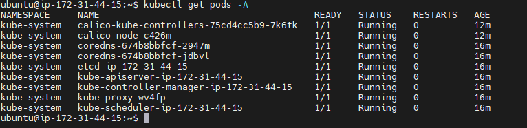

# Informe Técnico

## Introducción

Este informe técnico, recopila todo lo realizado para tener un entorno de desarrollo, el cual nos permita integrar nuevos cambios a los elementos presentados por Aether.

Para trabajar segun nuestras necesidades hicimos forks de algunos de los repos de Aether, los cuales se pueden encontrar en los siguientes enlaces:

GitHub repository for the OMEC Project ([https://github.com/omec-project](https://github.com/omec-project)): Microservices for SD-Core, plus the emulator (gNBsim) that subjects SD-Core to RAN workloads.

GitHub repository for the ONOS Project ([https://github.com/onosproject](https://github.com/onosproject)): Microservices for SD-RAN and ROC, plus the YANG models used to generate the Aether API.

GitHub repository for the ONF: [https://github.com/opennetworkinglab](https://github.com/opennetworkinglab) — OnRamp documentation and playbooks for deploying Aether.

Los forks los puede encontrar aquí en [este enlace](https://github.com/orgs/networkgcorefullcode/repositories).

En nuestro caso editamos el CI para adecuarlo a nuestras necesidades.

Al hacer forks podemos contribuir en un futuro al proyecto.

Las imagenes de docker se guardan en docker hub, si buscas network5gcore en docker hub deben de salirte las imagenes.

## Requisitos

- Ubuntu Server version 22.04 or later
- Docker
- Kubernetes
- Go version 1.24.4 or later

---

## 🛠️ Intalación del entorno de Kubernetes

---

Para desplegar Aether debemos tener un entorno de kubernetes, en el cual utilizando los diferentes charts de helm desplegaremos los diferentes servicios

### ✅ 1. **Preparar el Servidor**

Asegúrate de que tu Server tenga al menos:

- ✅ 2 CPUs (4 si vas a desplegar Aether)
- ✅ 4–8 GB de RAM (mejor con 8 GB para SD-Core)
- ✅ 20+ GB de almacenamiento
- ✅ Sistema operativo Ubuntu Server 22.04 LTS
- ✅ Seguridad: grupo de seguridad con puertos abiertos (SSH, 6443, 80, 443, 22, etc.)

---

### ✅ 2. **Configurar el entorno base**

```bash
# Actualizar paquetes
sudo apt update && sudo apt upgrade -y

# Desactivar swap (requisito de kubeadm)
sudo swapoff -a
sudo sed -i '/ swap / s/^/#/' /etc/fstab
```

---

### ✅ 3. **Instalar Docker (container runtime)**

```bash
sudo apt install -y apt-transport-https ca-certificates curl software-properties-common

curl -fsSL https://download.docker.com/linux/ubuntu/gpg | sudo gpg --dearmor -o /etc/apt/keyrings/docker.gpg

echo \
  "deb [arch=$(dpkg --print-architecture) signed-by=/etc/apt/keyrings/docker.gpg] https://download.docker.com/linux/ubuntu \
  $(lsb_release -cs) stable" | \
  sudo tee /etc/apt/sources.list.d/docker.list > /dev/null

sudo apt update
sudo apt install -y docker-ce docker-ce-cli containerd.io

# Habilitar Docker
sudo systemctl enable docker
sudo systemctl start docker
```

---

### ✅ 4. **Instalar Kubernetes (kubeadm, kubelet, kubectl)**

```bash
sudo apt-get update
# apt-transport-https may be a dummy package; if so, you can skip that package
sudo apt-get install -y apt-transport-https ca-certificates curl gpg

# If the directory `/etc/apt/keyrings` does not exist, it should be created before the curl command, read the note below.
# sudo mkdir -p -m 755 /etc/apt/keyrings
curl -fsSL https://pkgs.k8s.io/core:/stable:/v1.33/deb/Release.key | sudo gpg --dearmor -o /etc/apt/keyrings/kubernetes-apt-keyring.gpg

# This overwrites any existing configuration in /etc/apt/sources.list.d/kubernetes.list
echo 'deb [signed-by=/etc/apt/keyrings/kubernetes-apt-keyring.gpg] https://pkgs.k8s.io/core:/stable:/v1.33/deb/ /' | sudo tee /etc/apt/sources.list.d/kubernetes.list

sudo apt-get update
sudo apt-get install -y kubelet kubeadm kubectl
sudo apt-mark hold kubelet kubeadm kubectl

sudo systemctl enable --now kubelet
```

---

### ✅ 5. **Inicializar el clúster (modo single-node para pruebas)**

```bash
# (opcional) Usa tu IP pública o privada como advertise address
sudo kubeadm init \
  --pod-network-cidr=192.168.0.0/16 \
  --apiserver-advertise-address=$(hostname -I | awk '{print $1}') \
  --cri-socket=/var/run/containerd/containerd.sock

```

> ✅ Esto instalará un clúster con Calico/Flannel-compatible pod CIDR.

Si presentar problemas relacionados con que no encuentra el containerd.sock, puedes hacer lo siguiente:

Asegúrate de que containerd esté instalado

```bash
which containerd
```

Debe devolver algo como:

```bash
/usr/bin/containerd
```

Asegúrate de que containerd esté corriendo

```bash
sudo systemctl status containerd
```

Si no está corriendo, intenta:

```bash
sudo systemctl start containerd
```

Verifica que el archivo de configuración de containerd tenga habilitado el CRI

Ejecuta:

```bash
sudo containerd config default | sudo tee /etc/containerd/config.toml > /dev/null
```

Luego edita el archivo:

```bash
sudo nano /etc/containerd/config.toml
```

Busca esta sección:

```toml
[plugins."io.containerd.grpc.v1.cri"]
```

> Asegúrate de que no esté comentada y que esté habilitada. También asegúrate de que tenga:

```toml
  [plugins."io.containerd.grpc.v1.cri".containerd.runtimes.runc.options]
    SystemdCgroup = true
```

Reinicia containerd después de los cambios

```bash
sudo systemctl restart containerd
```

Verifica el socket
Asegúrate de que el socket exista:

```bash
ls -l /var/run/containerd/containerd.sock
```

> Debe aparecer como archivo tipo socket.

Vuelve a intentar la inicialización

```bash
sudo kubeadm init \
  --pod-network-cidr=192.168.0.0/16 \
  --apiserver-advertise-address=$(hostname -I | awk '{print $1}') \
  --cri-socket=/var/run/containerd/containerd.sock
```

---

### ✅ 6. **Configurar el entorno para el usuario actual**

```bash
mkdir -p $HOME/.kube
sudo cp -i /etc/kubernetes/admin.conf $HOME/.kube/config
sudo chown $(id -u):$(id -g) $HOME/.kube/config
```

---

### ✅ 7. **Instalar red de pods (ej. Calico)**

```bash
# Usando Calico como red de pods
kubectl apply -f https://raw.githubusercontent.com/projectcalico/calico/v3.27.0/manifests/calico.yaml
```

---

### ✅ 8. **Permitir que el nodo actúe como master y worker (modo prueba)**

```bash
kubectl taint nodes --all node-role.kubernetes.io/control-plane-
```

Esto es necesario si solo tienes **una máquina** y quieres que los pods de usuario (como Aether) se ejecuten ahí.

---

### ✅ 9. **Verifica que todo está funcionando**

```bash
kubectl get nodes
kubectl get pods -A
```

Debes ver algo como esto:



## Trabajando con Helm

### Instalando Helm

Ejecuta:

```bash
curl -fsSL -o get_helm.sh https://raw.githubusercontent.com/helm/helm/main/scripts/get-helm-3
chmod 700 get_helm.sh
./get_helm.sh
```

### Obtener charts

Aether proporciona una serie de charts de helm, los cuales podemos configurar segun nuestras necesidades. Estos charts los podemos encontrar en:

[https://charts.aetherproject.org](https://charts.aetherproject.org)

[https://charts.onosproject.org](https://charts.onosproject.org)

[https://charts.opencord.org](https://charts.opencord.org)

[https://charts.atomix.io](https://charts.atomix.io)

[https://sdrancharts.onosproject.org](https://sdrancharts.onosproject.org)

[https://charts.rancher.io/](https://charts.rancher.io/)

Los repos de github son los siguientes:

ROC: [https://github.com/onosproject/roc-helm-charts](https://github.com/onosproject/roc-helm-charts)

SD-RAN: [https://github.com/onosproject/sdran-helm-charts](https://github.com/onosproject/sdran-helm-charts)

SD-Core: [https://github.com/omec-project/sdcore-helm-charts](https://github.com/omec-project/sdcore-helm-charts).

De estos repos hicimos forks para trabajar segun nuestras necesidades.

ROC: [https://github.com/networkgcorefullcode/roc-helm-charts](https://github.com/networkgcorefullcode/roc-helm-charts)

SD-RAN: [https://github.com/networkgcorefullcode/sdran-helm-charts](https://github.com/networkgcorefullcode/sdran-helm-charts)

SD-Core: [https://github.com/networkgcorefullcode/sdcore-helm-charts](https://github.com/networkgcorefullcode/sdcore-helm-charts).

Primero desplegaremos el ROC, para ello iremos al helm relacionado con el roc, dentro hay un chart llamado aether-roc-umbrella, que reune varias dependencias para desplegar el roc de aether.

Ejecutar los siguientes comandos:

```bash
helm repo add stable https://charts.helm.sh/stable                        
helm repo add cord https://charts.opencord.org                          
helm repo add atomix https://charts.atomix.io                             
helm repo add onosproject https://charts.onosproject.org                       
helm repo add sdran https://sdrancharts.onosproject.org                  
helm repo add aether https://charts.aetherproject.org                     
helm repo add cetic https://cetic.github.io/helm-charts                  
helm repo add bitnami https://charts.bitnami.com/bitnami
helm repo update

helm search repo onos

## para revertir esto
helm repo remove stable
helm repo remove cord
helm repo remove atomix
helm repo remove onosproject
helm repo remove sdran
helm repo remove aether
helm repo remove cetic
helm repo remove bitnami
```

Ahora desplegaremos el ROC, ejecutando los siguientes comandos, puedes ver la guia en el siguiente enlace [https://docs.onosproject.org/developers/deploy_with_helm/](https://docs.onosproject.org/developers/deploy_with_helm/)

```bash
kubectl apply -f https://raw.githubusercontent.com/rancher/local-path-provisioner/master/deploy/local-path-storage.yaml
kubectl patch storageclass local-path -p '{"metadata": {"annotations":{"storageclass.kubernetes.io/is-default-class":"true"}}}'
```

```bash
kubectl create namespace micro-onos

helm install -n kube-system atomix atomix/atomix

helm install -n kube-system onos-operator onosproject/onos-operator

helm -n micro-onos install onos-umbrella onosproject/onos-umbrella

kubectl -n micro-onos get pods -w
```

Otros comandos utiles:

```bash
helm -n micro-onos ls

helm delete -n micro-onos onos-umbrella
helm delete -n kube-system onos-operator
helm delete -n kube-system atomix
```

Este comando para instalar la GUI: 

```bash
helm install -n micro-onos onos-gui onosproject/onos-gui

helm delete -n micro-onos onos-gui
```

Tambien podemos hacer lo siguientes, dirigirnos al repositorio roc-helm-charts y ejecutar el siguiente comando (Recomendamos este, ya que instala todos los servicios necesarios):

```bash
helm install roc5gc aether-roc-umbrella
```

Esta plantilla sirve para exponer un servicio y poder acceder a el desde fuera, puede ser util.

```bash
kubectl port-forward svc/<nombre-del-servicio> <puerto-local>:<puerto-del-servicio> -n <namespace>
```

Para acceder a la GUI utilizar los puertos 30256, 31194

Otra via de instalacion es dirigirnos a la carpeta helm-charts

Y ejecutar los siguientes comandos:

```bash
helm dependency build atomix-1.1.2/chart
helm dependency build onos-operator
cd aether-roc-umbrella
rm Chart.lock
helm dependency build .
cd ..
cd sd-core
rm Chart.lock
helm dependency build .
```

Ejecutar ahora:

```bash
helm install -n kube-system atomix atomix-1.1.2/chart
helm install -n kube-system onos-operator onos-operator
helm install -n roc5g rocamp aether-roc-umbrella
```

Comandos para borrar kubernetes:

```bash
sudo systemctl stop kubelet
sudo systemctl stop docker

sudo apt-get purge kubeadm kubectl kubelet kubernetes-cni kube*
sudo apt-get autoremove

# Reiniciar la pc en este paso
sudo rm -rf ~/.kube
sudo rm -rf /etc/kubernetes/
sudo rm -rf /var/lib/etcd/
sudo rm -rf /var/lib/kubelet/
sudo rm -rf /var/lib/dockershim/
sudo rm -rf /var/run/kubernetes/
sudo rm -rf /etc/cni/
sudo rm -rf /opt/cni/
sudo rm -rf /opt/local-path-provisioner

sudo docker system prune -a --volumes

kubectl version
# Debe decir comando no encontrado

kubeadm version
# Debe decir comando no encontrado

sudo rm -rf $HOME/.cache/helm
sudo rm -rf $HOME/.config/helm
sudo rm -rf $HOME/.local/share/helm

```
