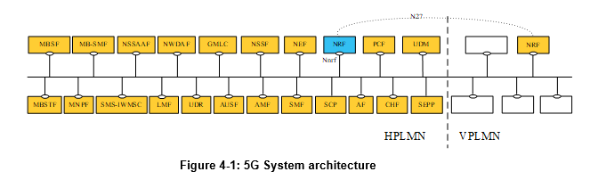

# NRF

## Introducción

Esto es un estudio del TS 29.510. Enfocado en el NRF de Aether y las funcionalidades que soporta y como agregarle nuevas.

La Función de Repositorio de Funciones de Red (NRF, por sus siglas en inglés) es la entidad de red en el Núcleo 5G (5GC) que soporta las siguientes funcionalidades:

- Mantiene el perfil de las instancias de Funciones de Red (NF) disponibles y los servicios que soportan.
- Mantiene el perfil de las instancias de SCP disponibles.
- Mantiene el perfil de las instancias de SEPP disponibles.
- Permite que otras instancias de NF o SCP se suscriban y reciban notificaciones sobre el registro en el NRF de nuevas instancias NF de un tipo dado o de instancias SEPP. También permite que las instancias SCP se suscriban y reciban notificaciones sobre el registro en el NRF de nuevas instancias SCP.
- Soporta la función de descubrimiento de servicios. Recibe solicitudes de descubrimiento de NF de instancias NF o SCP y proporciona información sobre las instancias NF disponibles que cumplen ciertos criterios (por ejemplo, que soportan un servicio específico).
- Soporta la función de descubrimiento de SCP. Recibe solicitudes de descubrimiento de perfiles SCP de otras instancias SCP y proporciona información sobre las instancias SCP disponibles que cumplen ciertos criterios (por ejemplo, que sirven a un conjunto específico de NF).
- Soporta la función de descubrimiento de SEPP. Recibe solicitudes de descubrimiento de perfiles SEPP de otras instancias NF o SCP y proporciona información sobre las instancias SEPP disponibles que cumplen ciertos criterios (por ejemplo, que soportan conectividad con una PLMN remota).

En la mayoría de las represtanciones que se hacen en el 3GPP, muchas veces no se representa el NRF, ya que interactua siempre con todas las NF. Vale aclarar que en los casos de roaming, los NRF de distintias PLMN interactuan por la interfaz N27, aunque esta interfaz es solo por cuestiones de representacion, al final se terminan utilizando los servicios SBI que brinda el NRF.

En el caso de SNPN, el NRF proporciona servicios, por ejemplo, en los siguientes escenarios:

- Para un SNPN en el que no se admite roaming (ver 3GPP TS 23.501 [2], cláusula 5.30.2.0);
- Para el caso de acceso de UE a SNPN utilizando credenciales de un Gestor de Credenciales (ver 3GPP TS 23.501 [2], cláusula 5.30.2.9);
- Para el caso de incorporación (Onboarding) de UEs para SNPN (ver 3GPP TS 23.501 [2], cláusula 5.30.2.10).

---

## Servicios ofrecidos

- Nnrf_NFManagement
- Nnrf_NFDiscovery
- Nnrf_AccessToken (OAuth2 Authorization)
- Nnrf_Bootstrapping

Cada uno de estos servicios expone un API http. Las demas NF interactuan con estas API para realizar diversas operaciones.

El NRF proporciona servicios en los siguientes escenarios de SNPN (ver cláusulas 4.17.4a, 4.17.5a, 5.2.7.2 y 5.2.7.3 en 3GPP TS 23.502 [3]):

- En un SNPN donde no se admite roaming, lo que corresponde a los servicios del NRF en la misma PLMN;
- En el caso de acceso de UE a SNPN utilizando credenciales de un Gestor de Credenciales con AAA-S, lo que corresponde a los servicios del NRF en la misma PLMN;
- En el caso de acceso de UE a SNPN utilizando credenciales de un Gestor de Credenciales con AUSF y UDM, lo que corresponde a los servicios del NRF entre diferentes PLMN;
- En el caso de incorporación (Onboarding) de UEs para SNPN sin utilizar un Servidor de Credenciales por Defecto, lo que corresponde a los servicios del NRF en la misma PLMN;
- En el caso de incorporación de UEs para SNPN utilizando un Servidor de Credenciales por Defecto con AAA-S, lo que corresponde a los servicios del NRF en la misma PLMN;
- En el caso de incorporación de UEs para SNPN utilizando un Servidor de Credenciales por Defecto con AUSF y UDM, lo que corresponde a los servicios del NRF entre diferentes PLMN.

## Nnrf_NFManagement

El servicio Nnrf_NFManagement permite que una instancia de NF, SCP o SEPP en la PLMN de servicio registre, actualice o elimine su perfil en el NRF.

El servicio Nnrf_NFManagement también permite que una instancia de NRF registre, actualice o elimine su perfil en otro NRF dentro de la misma PLMN.

Además, permite que una NF o un SCP se suscriban para recibir notificaciones sobre el registro, eliminación y cambios de perfil de instancias NF, junto con sus posibles servicios NF, o de instancias SEPP. También habilita que un SCP se suscriba para recibir notificaciones sobre el registro, eliminación y cambios de perfil de otras instancias SCP.
El perfil de la NF consiste en parámetros generales de la instancia NF, así como los parámetros de las diferentes instancias de servicios NF expuestos por la instancia NF, si corresponde.

La PLMN del NRF puede comprender uno o varios IDs de PLMN (es decir, MCC y MNC). Un NRF configurado con múltiples IDs de PLMN debe soportar el registro, actualización y eliminación del perfil de instancias de funciones de red de cualquiera de estos IDs de PLMN.

El servicio Nnrf_NFManagement también permite recuperar una lista de instancias de NF, SCP o SEPP actualmente registradas en el NRF o el perfil NF de una instancia específica de NF, SCP o SEPP.
El servicio Nnrf_NFManagement también permite verificar si las NFs, SCPs y SEPPs registradas están operativas.

### Las operaciones

Las operaciones que se realizan con este servicio son:

- NFRegister
- NFUpdate
- NFDeregister
- NFStatusSubscribe
- NFStatusNotify
- NFStatusUnsubscribe
- NFListRetrieval
- NFProfileRetrieval
- SharedDataRetrieval

Un NRF puede formar parte de un conjunto de NRF (NRF set), en cuyo caso todas las instancias de NRF del conjunto comparten los mismos datos de contexto (por ejemplo, perfiles de NF registrados, suscripciones de estado de NF). Si es así:

- El consumidor de servicios NF puede estar configurado con el ID del conjunto de NRF o puede descubrirlo en la respuesta de arranque (Bootstrapping) del NRF.
- El consumidor de servicios NF puede registrarse en cualquiera de las instancias de NRF del conjunto. Si la instancia de NRF donde el consumidor de servicios NF se registró deja de estar disponible, el consumidor de servicios NF no necesita volver a registrarse en una nueva instancia de NRF dentro del conjunto.
- El NRF puede proporcionar una indicación de vinculación (binding) al consumidor de servicios NF, por ejemplo, cuando el consumidor de servicios NF se registra o actualiza su perfil NF en el NRF o cuando envía solicitudes de latido (heartbeat), para indicar una vinculación preferida del consumidor de servicios NF a una instancia específica de NRF dentro del conjunto, por ejemplo, basada en la ubicación o el centro de datos del consumidor de servicios NF que se está registrando o ya está registrado.

NOTA 3: El consumidor de servicios NF puede recuperar la información del conjunto de NRF desde el NRF a través del servicio Nnrf_NFDiscovery, según se especifica en la cláusula 5.3.2.1.

#### NFRegister

Esta operación de servicio se utiliza para:

- Registrar una NF en el NRF proporcionando el perfil de la NF solicitante al NRF, y el NRF marca la NF solicitante como disponible para ser descubierta por otras NFs;
- Registrar servicios asociados a una instancia de NF existente;
- Registrar información del NRF en otro NRF, y esta información se utiliza para reenviar o redirigir solicitudes de descubrimiento de servicios.

Antes de que una instancia de NF registre su perfil NF en el NRF, la instancia de NF debe verificar las capacidades del NRF enviando una solicitud OPTIONS al recurso "nf-instances" (ver cláusula 6.1.3.2.3.2), a menos que la instancia de NF ya haya enviado una solicitud de Bootstrapping al NRF y recibido el atributo nrfFeatures en la respuesta. El NRF puede indicar en la respuesta capacidades como el soporte para recibir contenido comprimido en la solicitud HTTP PUT utilizada para el registro del perfil NF, o el soporte de atributos específicos del perfil NF.

NOTA 2: Una NF Rel-16 necesita registrar la lista de instancias de servicios NF en el atributo de arreglo "nfServices" hacia un NRF que no soporte la característica Service-Map (es decir, un NRF Rel-15).

Para registrar un NRF en otro NRF debemos tener en cuenta lo siguiente:

a)	el NRF que se registra debe establecer el nfType en "NRF" en el nfProfile;

b)	el NRF que se registra debe establecer nfService para que contenga "nnrf-disc", "nnrf-nfm" y opcionalmente "nnrf-oauth2" en el nfProfile;

c)	el NRF que se registra puede incluir nrfInfo, que contiene información de, por ejemplo, udrInfo, udmInfo, ausfInfo, amfInfo, smfInfo, upfInfo, pcfInfo, bsfInfo, nefInfo, chfInfo, pcscfInfo, lmfInfo, gmlcInfo, aanfInfo, nfInfo y nsacfInfo en el nfProfile configurado localmente en el NRF o recibido durante el registro de otras NFs; esto significa que el NRF que se registra es capaz de proporcionar el servicio de descubrimiento de NFs sujeto a esa información;

d)	si el NRF recibe un registro de NF con nfType establecido en "NRF", el NRF debe usar la información contenida en el nfProfile para dirigir el NRF que se registra al reenviar o redirigir solicitudes de descubrimiento de servicios NF.

Sobre el Shared Data registration no abordaremos aqui

#### NFUpdate, NFDeregister

Sobre estas operaciones no profundizaremos en este documento.

#### NFStatusSubscribe

Esta operación de servicio se utiliza para:

- crear una suscripción para que un consumidor de servicios NF pueda solicitar ser notificado cuando instancias de NF de un conjunto determinado, siguiendo ciertos criterios de filtrado, sean registradas o eliminadas en el NRF o cuando su perfil sea modificado;
- crear una suscripción a una instancia específica de NF para que un consumidor de servicios NF pueda solicitar ser notificado cuando el perfil de dicha instancia de NF sea modificado o cuando la instancia de NF sea eliminada del NRF.

La subscripción se puede realizar en el mismo PLMN, donde solo interactuan la NF consumer con la NRF. En diferentes PLMN la interacción es entre las NRF para establecer la subscripción

Hay más casos donde intervienes otras NRF de por medio.

## Conclusiones

Con este breve estudio podemos hacer comparaciones con las funciones actuales que ofrece el NRF de Aether:

Una de las principales limitantes es que el NRF de Aether no tiene funciones integradas para interactuar con otros NRF. Lo cual provoca que no podamos realizar varias de las funciones que esta configuracion permite. Por ejemplo esto provoca que no podamos interactuar con otras NF en otros PLMN o que no se puedan redirigir solicitudes de descubrimiento de una NF Instance hacia otra NRF.

El descubrimiento de las NF en Aether es flexible, ya que incorpora una serie de parametros que nos sirven para filtrar segun varios criterios.
