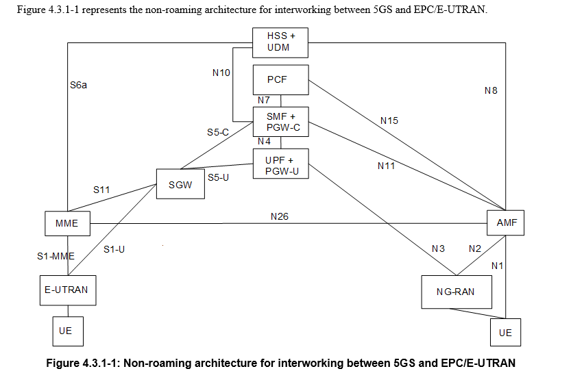
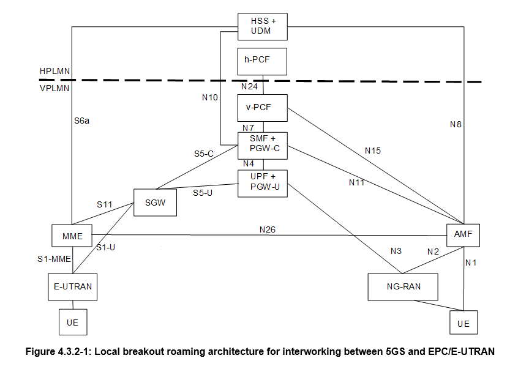
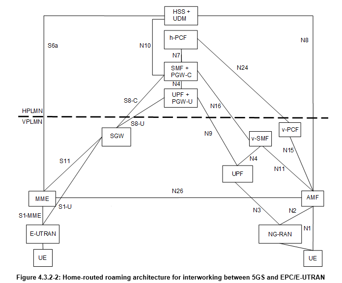

# Roaming 5G/4G

NOTA 1: La interfaz N26 es una interfaz inter-CN entre el MME y el 5GS AMF para habilitar la interoperabilidad entre el EPC y el núcleo NG. El soporte de la interfaz N26 en la red es opcional para la interoperabilidad. N26 soporta un subconjunto de las funcionalidades (esenciales para la interoperabilidad) que se soportan sobre S10.  

NOTA 2: PGW-C + SMF y UPF + PGW-U están dedicados a la interoperabilidad entre 5GS y EPC, lo cual es opcional y depende de la capacidad de red MM del UE y la suscripción del UE. Los UEs que no requieren interoperabilidad entre 5GS y EPC pueden ser atendidos por entidades no dedicadas a la interoperabilidad, es decir, por PGW o SMF/UPF.  

NOTA 3: Puede haber otro UPF (no mostrado en la figura anterior) entre el NG-RAN y el UPF + PGW-U, es decir, el UPF + PGW-U puede soportar N9 hacia un UPF adicional, si es necesario.

NOTA 4: Las figuras y procedimientos en esta especificación que muestran un SGW no asumen si el SGW se implementa como un SGW monolítico o como un SGW dividido en funcionalidad de plano de control y plano de usuario, como se describe en TS 23.214 [32].

NOTA 1: Puede haber otro UPF (no mostrado en la figura anterior) entre el NG-RAN y el UPF + PGW-U, es decir, el UPF + PGW-U puede soportar N9 hacia un UPF adicional, si es necesario.

NOTA 2: La interfaz S9 del EPC no es necesaria ya que no existe ninguna implementación conocida.

