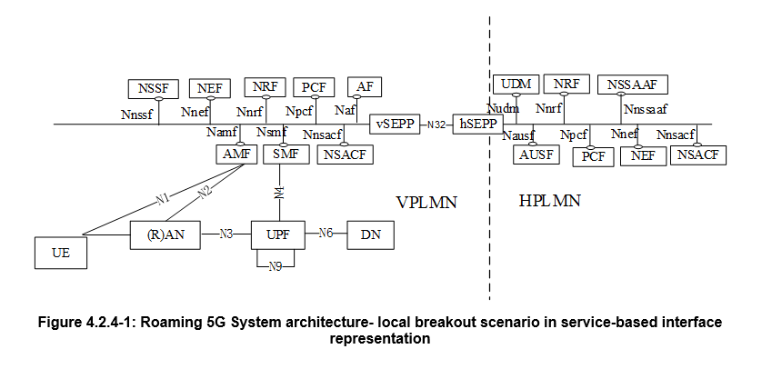

# Roaming 5G-5G

NOTA 1: En la arquitectura LBO, el PCF en la VPLMN puede interactuar con el AF para generar reglas PCC para servicios entregados a través de la VPLMN. El PCF en la VPLMN utiliza políticas configuradas localmente según el acuerdo de roaming con el operador HPLMN como entrada para la generación de reglas PCC. El PCF en la VPLMN no tiene acceso a la información de políticas de suscriptores del HPLMN.

NOTA 2: Un SCP puede usarse para la comunicación indirecta entre NFs y servicios NF dentro de la VPLMN, dentro de la HPLMN, o dentro de ambas VPLMN y HPLMN. Para simplificar, el SCP no se muestra en la arquitectura de roaming.

NOTA 3: Para mayor claridad, los NWDAF(s) con capacidad de intercambio de roaming (RE-NWDAF) y sus conexiones con otros NFs no se representan en el diagrama de arquitectura basada en servicios. Para más información sobre la arquitectura de análisis de datos de red, consulte TS 23.288.

NOTA 4: Dependiendo de la arquitectura desplegada, el NSACF Primario o Centralizado en la VPLMN puede obtener el número máximo de UEs registrados o el número máximo de sesiones PDU LBO a ser aplicadas desde el NSACF Primario o Centralizado del HPLMN, como se describe en la cláusula 5.15.11.3.1.

Ver mas escenarios en el 3GPP TS 23.501

Para los escenarios de roaming descritos anteriormente, cada PLMN implementa funcionalidades de proxy para asegurar la interconexión y ocultar la topología en las interfaces inter-PLMN. El enrutamiento basado en suscripción hacia una red central específica, como se indica en la cláusula 6.44 de TS 22.261, permite el encaminamiento del tráfico de señalización y usuario de ciertos UEs hacia un PLMN objetivo que puede no ser ni el PLMN de servicio ni el HPLMN del UE. Esto se logra seleccionando NFs que residen en el PLMN objetivo. El NRF del HPLMN, con soporte opcional del NRF en ese PLMN objetivo según lo especificado en la cláusula 4.17.5 de TS 23.502, es responsable de proporcionar la información adecuada de instancias de funciones de red durante el descubrimiento y selección de funciones de red.
